# Screenlamp Toolkit Tutorial

This tutorial explains how the individual screenlamp tools (located in the [screenlamp/tools](https://github.com/rasbt/screenlamp/tree/master/tools) subdirectory) work in the context of a small virtual screening example. 

The workflow we are going to use is similar to the [Pipeline Tutorial](pipeline-tutorial-1), which uses a pre-constructed, automated virtual pipeline based using the tools explained in this tutorial. While the [Pipeline Tutorial](pipeline-tutorial-1) provides a high-level overview and a more convenient, pre-constructed pipeline, this tool aims to explain the building blocks behind it so that users can understand and learn how to construct their own pipelines and/or modify the existing pipeline presented in the [Pipeline Tutorial](pipeline-tutorial-1).

To explain the main steps in a typical filtering pipeline using screenlamp, this tutorial will work through the following individual steps performed by the pipeline in the [Pipeline Tutorial](pipeline-tutorial-1) incrementally:

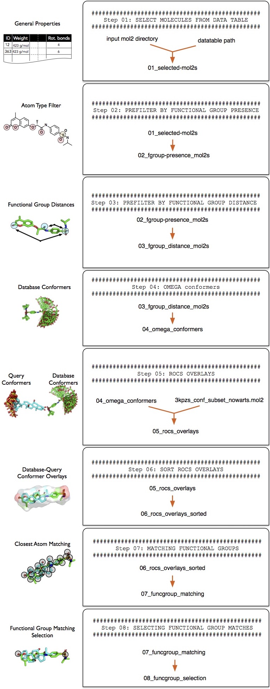


(A higher-resolution PDF version of this flowchart is available [here](https://github.com/rasbt/screenlamp/blob/master/docs/sources/images/automated-pipeline-flowchart.pdf).)

## Obtaining and Preparing the Dataset


### MOL2 Input Files

The tools presented in this tutorial are compatible with MOL2 files of arbitrary size. However, to minimize the computation time for illustration throughout this tutorial, we are only going to use a small subset of molecules.

A typical use case for these would be the screening of all ~18,000,000 *Drug-Like* molecules from [ZINC](http://zinc.docking.org), which is available in MOL2 format on ZINC [here](http://zinc.docking.org/subsets/drug-like). Please note that screenlamp supports both Tripos MOL2 (`*.mol2`) files and gzipped Tripos MOL2 files (`*.mol2.gz`) out of the box. Thus, if your input dataset is in gzipped format, you can use it right away without having to make any adjustments or decompressing it. However, please note that the decompressing and compressing operations that are performed when working with gzipped files have an additional toll on computational performance.

With kind permission from John Irwin and the ZINC team, we are using a random subset of 70,000 small molecules that we prepared for this tutorial. This subset from ZINC is split into 7 multi-MOL2 file with 10,000 molecules each: `partition_mol2_1.mol2` to `partition_mol2_7.mol2`. 

For this tutorial, please download the dataset by clicking the following link and unzip it on your machine that you are using for the virtual screening run: [https://s3-us-west-2.amazonaws.com/screenlamp-datasets/pipeline-tutorial_1/partition_1-7.zip](https://s3-us-west-2.amazonaws.com/screenlamp-datasets/pipeline-tutorial_1/partition_1-7.zip)


### Datatable for Prefiltering

For this particular tutorial, you'll also need a data table containing general information about these molecules. Although the partitions you downloaded above are only a small, modified subset of the [ZINC](http://zinc.docking.org) drug-like molecules, we could use the full ~18,000,000 molecule Drug-like table available for download at [http://zinc.docking.org/subsets/drug-like](http://zinc.docking.org/subsets/drug-like). To download the tab-separated table, click the [Properties](http://zinc.docking.org/db/bysubset/3/3_prop.xls) link on the [ZINC Drug-like](http://zinc.docking.org/subsets/drug-like) page. 

However, Please note that the size of the data table is about ~1.8 Gb, and thus, the download may take a while depending on your internet connection. Alternatively, we recommend using a smaller data table containing only ~170,000 molecules; to download this table, please use the following link: [https://s3-us-west-2.amazonaws.com/screenlamp-datasets/pipeline-tutorial_1/small_table_p1-7.txt](https://s3-us-west-2.amazonaws.com/screenlamp-datasets/pipeline-tutorial_1/small_table_p1-7.txt)


### Query Molecule

The third data file you'll need for ligand-based virtual screening is the query molecule. For this tutorial, please download the following multi-conformer MOL2 file: [https://s3-us-west-2.amazonaws.com/screenlamp-datasets/pipeline-tutorial_1/3kpzs_query.mol2](https://s3-us-west-2.amazonaws.com/screenlamp-datasets/pipeline-tutorial_1/3kpzs_query.mol2)

---

**Important Note**

All code in this tutorial is executed using a Python 3.6 interpreter. The code has not been tested in Python 2.7.

---

## Data Storage and Project Layout

After downloading the files described in the previous subsection, create a new directory called `tk-tutorial_data` to store these files. Before you continue with the tutorial, please make sure that the `tk-tutorial_data` directory contains the following files and adheres to the following directory structure:


Next, we are going to create a new directory, `tutorial-results`, to store the results we are going to generate in this tutorial:


```python
! mkdir tutorial-results
```

<div class="alert alert-block alert-info"> &#9888; Throughout this tutorial, the '!' command denotes a new command line terminal prompt (for example, bash shell).</div>

<div class="alert alert-block alert-info"> &#9888; This tutorial assumes that the screenlamp tools are available from a directory called 'tools', but you can store the screenlamp tools in any directory you like as long as you replace 'tools' with the correct path to this directory.</div>

Before we start exploring the tools contained in screenlamp's `tools` folder, let's start with a simple script that we are going to use throughout this tutorial to count the number of structures in a mol2 file or directory containing mol2 files.

Using the `count_mol2.py` script, we can now count the number of structures in each mol2 file in our input directory like so:


```python
! python tools/count_mol2.py -i tk-tutorial_data/partition_1-7/
```

    partition_1.mol2 : 10000
    partition_2.mol2 : 10000
    partition_3.mol2 : 10000
    partition_4.mol2 : 10000
    partition_5.mol2 : 10000
    partition_6.mol2 : 10000
    partition_7.mol2 : 10000
    Total : 70000


As we can see, each of the 7 partitions in our dataset contains 10,000 molecules; we will be working with 70,000 structures in total.

## General Blacklist & Whitelist Filtering

This section provides a brief introduction to the general concept of how the filtering of structures is performed within screenlamp. The general workflow consists of two step

1. Creating an "ID file" (more about this later)
2. Use the "ID file" to select the corresponding 3D-structures from MOL2 files

Furthermore, there are 2 kinds of filtering procedures. Via includelist-filtering, we select all molecules that are **listed in** the ID file. Vice versa, excludelist-filtering is used to select all molecules that are **not listed in** the ID file.

### Generating ID Files from Molecules

First, we are going to generate an ID file of all structures in the mol2 files of the 7 partitions. 

<div class="alert alert-block alert-info"> &#9888; 
In the context of this tutorial, an "ID file" is a plaintext file that contains the molecule identifiers fetched from the mol2 files.
</div>

We can create such an ID file using the `mol2_to_id.py` screenlamp script as shown below:


```python
! python tools/mol2_to_id.py \
  --input tk-tutorial_data/partition_1-7/ \
  --output tutorial-results/all-mol2ids.txt
```

    Processing partition_1.mol2 | scanned 10000 molecules | 9992 mol/sec
    Processing partition_2.mol2 | scanned 10000 molecules | 13691 mol/sec
    Processing partition_3.mol2 | scanned 10000 molecules | 17576 mol/sec
    Processing partition_4.mol2 | scanned 10000 molecules | 15460 mol/sec
    Processing partition_5.mol2 | scanned 10000 molecules | 13929 mol/sec
    Processing partition_6.mol2 | scanned 10000 molecules | 14212 mol/sec
    Processing partition_7.mol2 | scanned 10000 molecules | 14279 mol/sec
    Finished


To check that the creation of the ID file was successful and to see how it looks like, we will use the Unix/Linux `head` command line tool to display the first 10 rows of the newly created ID file:


```python
! head tutorial-results/all-mol2ids.txt
```

    ZINC57271411
    ZINC50764925
    ZINC65255333
    ZINC06394508
    ZINC65292537
    ZINC65375610
    ZINC31820077
    ZINC65395084
    ZINC00205726
    ZINC01458151


To illustrate the concept of includelist and excludelist filtering in the following sections, let us now create a small ID list file, we name it `5-mol2ids.txt`, that contains 5 IDs only, using the `echo` command in a Unix/Linux terminal:


```python
! echo "\
ZINC65255333\n\
ZINC06394508\n\
ZINC65292537\n\
ZINC65375610\n\
ZINC31820077" > tutorial-results/5-mol2ids.txt
```

The execution of the preceeding command will create a text file that looks as follows:
    
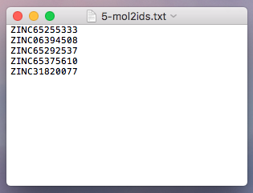

### Whitelist Filtering

Now, using the script `id_to_mol2.py`, we can filter a directory of mol2 files for molecules that are listed in an ID file using the `--whitefilter True` option. Executing the following command will look for the structures corresponding to the five molecule IDs included in the `5-mol2ids.txt` that we created in the previous section, and write the corresponding structure files to a new directory that we will call `includelist_example`:


```python
! python tools/id_to_mol2.py \
  --input tk-tutorial_data/partition_1-7/ \
  --output tutorial-results/includelist-example \
  --id_file tutorial-results/5-mol2ids.txt \
  --includelist True
```

    Processing partition_1.mol2 | scanned 10000 molecules | 15319 mol/sec
    Processing partition_2.mol2 | scanned 10000 molecules | 14400 mol/sec
    Processing partition_3.mol2 | scanned 10000 molecules | 14980 mol/sec
    Processing partition_4.mol2 | scanned 10000 molecules | 14893 mol/sec
    Processing partition_5.mol2 | scanned 10000 molecules | 14170 mol/sec
    Processing partition_6.mol2 | scanned 10000 molecules | 12873 mol/sec
    Processing partition_7.mol2 | scanned 10000 molecules | 12457 mol/sec
    Finished


The output directory, `tutorial-results/includelist-example`, should now contain only mol2 structures that are labeled with IDs contained in the `5-mol2ids.txt` text file.

Please note that `id_to_mol2.py` creates a new file for each mol2 file it scanned; however, the creation of such a file does not imply that structures were found for this particular partition via includelist filtering and could remain empty. For example, the five structure IDs in the `5-mol2ids.txt` all refer to structures from `partition_1` as we can check by running the already familiar `count_mol2.py` script:


```python
! python tools/count_mol2.py \
  --input tutorial-results/includelist-example
```

    partition_1.mol2 : 5
    partition_2.mol2 : 0
    partition_3.mol2 : 0
    partition_4.mol2 : 0
    partition_5.mol2 : 0
    partition_6.mol2 : 0
    partition_7.mol2 : 0
    Total : 5


### Blacklist Filtering

Similar to the includelisting example in the previous section, we can use a ID file for excludelist filtering. Blacklist filtering means that all molecules that are ***not*** listed in an ID file will be selected. In order to perform excludelist filtering, we use the setting `--includelist False` as shown below:


```python
! python tools/id_to_mol2.py \
  --input tk-tutorial_data/partition_1-7/ \
  --output tutorial-results/excludelist-example \
  --id_file tutorial-results/5-mol2ids.txt \
  --includelist False
```

    Processing partition_1.mol2 | scanned 10000 molecules | 12772 mol/sec
    Processing partition_2.mol2 | scanned 10000 molecules | 8715 mol/sec
    Processing partition_3.mol2 | scanned 10000 molecules | 9105 mol/sec
    Processing partition_4.mol2 | scanned 10000 molecules | 13333 mol/sec
    Processing partition_5.mol2 | scanned 10000 molecules | 9869 mol/sec
    Processing partition_6.mol2 | scanned 10000 molecules | 12444 mol/sec
    Processing partition_7.mol2 | scanned 10000 molecules | 12276 mol/sec
    Finished


This time, we expect 69995 structures to be obtained after the filtering, since we scanned 70,000 molecules and had 5 molecules on our ID excludelist:


```python
! python tools/count_mol2.py \
  --input tutorial-results/excludelist-example
```

    partition_1.mol2 : 9995
    partition_2.mol2 : 10000
    partition_3.mol2 : 10000
    partition_4.mol2 : 10000
    partition_5.mol2 : 10000
    partition_6.mol2 : 10000
    partition_7.mol2 : 10000
    Total : 69995


## Step 1 -- Filtering via Features from Data Tables

In this section, we will apply the first filtering step, which constitutes step 1 in the pipeline overview:


Filtering via screenlamp is typically done in 2 steps:

- Step 1: Create an ID file containing the names of the molecules of interest.
- Step 2: Obtain the structures of molecules of interest, using the ID file, from MOL2 files.

In this filtering step, we are going to create an ID file of molecules of interest from a pre-existing data table, for instance, the "properties" files available on [ZINC](http://zinc.docking.org/subsets/drug-like). For this example, we are going to use the `small_table_p1-7.txt` subset that we downloaded earlier (see ["Obtaining and Preparing the Dataset"](#Obtaining-and-Preparing-the-Dataset)), since the whole data table of drug like molecules is ~2 Gb in size, and thus it may take a long time to download it on machines with a low-bandwidth internet connection. However, in case you have already downloaded the drug-like properties file (3_prop.xls) from ZINC, please feel free to use it instead. 

<div class="alert alert-block alert-info"> &#9888; Note that while 3_prop.xls has a file ending that is typical for Microsoft Excel, it is not an Excel file but a plain text file with tab-separated columns.</div>

To get a brief impression of the file contents, we use the `head` tool to display the first ten entries:


```python
! head tk-tutorial_data/small_table_p1-7.txt
```

    ZINC_ID	MWT	LogP	Desolv_apolar	Desolv_polar	HBD	HBA	tPSA	Charge	NRB	SMILES
    ZINC00000010	217.2	1.42	5.57	-41.98	0	4	66	-1	2	C[C@@]1(C(=O)C=C(O1)C(=O)[O-])c2ccccc2
    ZINC00000012	289.356	1.28	4.89	-24.55	2	4	66	0	5	c1ccc(cc1)C(c2ccccc2)[S@](=O)CC(=O)NO
    ZINC00000017	281.337	1.33	3.06	-23.33	2	6	87	0	4	CCC[S@](=O)c1ccc2c(c1)[nH]/c(=N\C(=O)OC)/[nH]2
    ZINC00000017	281.337	1.33	3.07	-19.2	2	6	87	0	4	CCC[S@](=O)c1ccc2c(c1)[nH]/c(=N/C(=O)OC)/[nH]2
    ZINC00000018	212.31799999999998	2.0	5.87	-8.2	1	3	32	0	4	CC(C)C[C@@H]1C(=O)N(C(=S)N1)CC=C
    ZINC00000021	288.411	3.85	4.02	-40.52	1	3	30	1	6	CCC(=O)O[C@]1(CC[NH+](C[C@@H]1CC=C)C)c2ccccc2
    ZINC00000022	218.27599999999998	3.21	0.47	-48.57	1	3	52	-1	5	C[C@@H](c1ccc(cc1)NCC(=C)C)C(=O)[O-]
    ZINC00000025	251.35299999999998	3.6	2.4	-41.56	2	2	40	1	5	C[C@H](Cc1ccccc1)[NH2+][C@@H](C#N)c2ccccc2
    ZINC00000030	297.422	2.94	0.89	-37.97	3	3	47	1	6	C[C@@H](CC(c1ccccc1)(c2ccccc2)C(=O)N)[NH+](C)C


Since it can sometimes be hard to read tab-separated tables as regular text output, the screenshot below shows the same table excerpt opened in a spreadsheet program such as LibreOffice Calc or Microsoft Excel:


Using the `datatable_to_id.py` script, we can select only those molecule IDs (here: stored in the ZINC_ID column) that match certain criteria, which we can flexibly define based on the column data in this table. For example, we can select only those molecules that have at most 7 rotatable bonds and have a molecular weight of at least 200 g/mol using the selection string `"(NRB <= 7) & (MWT >= 200)"` as follows:


```python
! python tools/datatable_to_id.py \
  --input tk-tutorial_data/small_table_p1-7.txt \
  --output tutorial-results/01_selected_mol2s.txt \
  --id_column "ZINC_ID" \
  --selection "(NRB <= 7) & (MWT >= 200)"
```

    Using columns: ['ZINC_ID', 'NRB', 'MWT']
    Using selection: (chunk.NRB <= 7) & (chunk.MWT >= 200)
    Processed 169984 rows | 351943 rows/sec
    Selected: 162622


The selection syntax is quite simple: Parentheses must surround each criterion, and multiple criteria can be chained together using the logical AND symbol `'&'`. For example, to add a third criterion to the selection string to exclude larger molecules that are heavier than 400 g/mol, the selection string becomes `"(NRB <= 7) & (MWT >= 200) & (MWT <= 400)"`.

The following relational operators are supported in the selection string:

- `!=` : not equal to
- `==` : equal to
- `<`  : less than
- `>`  : greater than
- `>=` : equal to or greater than
- `<=` : equal to or greater than


If you encounter issues with individual selection strings, please check that the specified column is indeed present in the table you provided. Also, the `datatable_to_id.py` tool assumes that the input table is tab-separated. If you have tables that use a different delimiter to separate columns, please specify the column separator using the `--separator` parameter. For example, if our input table was a CSV file, we would pass the following, additional argument to the `tools/datatable_to_id.py` function: `--separator ","`.


Below are some additional examples of correct and incorrect selection strings that can help you with debugging the selection strings if you should encounter problems:

- Correct: `"(MWT >= 200) & (NRB <= 7)"`
- Wrong: `"( MWT >= 200) & ( NRB <= 7)"` [spacing between parentheses and column names]
- Wrong: `"MWT >= 200 & NRB <= 7"` [expressions seperated by logical '&' operator not enclosed in parentheses]
- Wrong: `"(mwt >= 200) & (nrb <= 7)"` [column names don't match the columns in the data table file]
- Wrong: `"(mwt>=200) & (nrb<=7)"` [no whitespace before and after operators for comparison]


As mentioned at the beginning of this section, filtering consists of two steps:
    
1. Creating an ID file of molecule names
2. Selecting molecules from MOL2 files using the ID file from step 1

We already completed step 1, and now, we are going the ID file we just created to create MOL2 files that only contain the molecules of interest (i.e., molecules with a maximum number of 7 rotatable bonds and a molecular weight of at least 200 g/mol2). Consequently, we use the ID file `tutorial-results/01_selected_mol2s.txt` to select the molecules of interest from out MOL2 database at `tk-tutorial_data/partition_1-7/` as follows:


```python
! python tools/id_to_mol2.py \
  --input tk-tutorial_data/partition_1-7/ \
  --output tutorial-results/01_selected_mol2s/ \
  --id_file tutorial-results/01_selected_mol2s.txt \
  --includelist True
```

    Processing partition_1.mol2 | scanned 10000 molecules | 12021 mol/sec
    Processing partition_2.mol2 | scanned 10000 molecules | 9435 mol/sec
    Processing partition_3.mol2 | scanned 10000 molecules | 7823 mol/sec
    Processing partition_4.mol2 | scanned 10000 molecules | 10801 mol/sec
    Processing partition_5.mol2 | scanned 10000 molecules | 8901 mol/sec
    Processing partition_6.mol2 | scanned 10000 molecules | 8661 mol/sec
    Processing partition_7.mol2 | scanned 10000 molecules | 8167 mol/sec
    Finished


```python
! python tools/count_mol2.py \
  --input tutorial-results/01_selected_mol2s/
```

    partition_1.mol2 : 8628
    partition_2.mol2 : 8501
    partition_3.mol2 : 8537
    partition_4.mol2 : 8476
    partition_5.mol2 : 8535
    partition_6.mol2 : 8518
    partition_7.mol2 : 8555
    Total : 59750


As we can see from the output of `count_mol2.py`, we now have a slightly smaller database consisting of 59750 molecules -- we started with 70,000 structures to which we applied the selection criteria `"(NRB <= 7) & (MWT >= 200)"`.

## Filtering Step 2 -- Presence and Absence of Functional Groups

In this second filtering step, we will select molecules that contain certain types of atoms and functional groups.

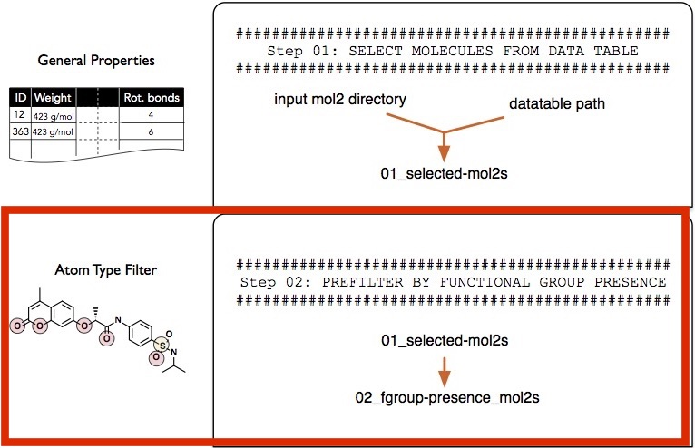

In the simple example presented in this section, we will consider molecules that contain at least one sp3 sulfur atom (as it can be found in sulfate groups) and at least one sp2 oxygen atom (keto group). 

When we filter by atom type, we can use the following MOL2 labels to specify filtering criteria:

  - `atom_id`
  - `atom_name`
  - `atom_type`
  - `subst_id`
  - `subst_name`
  - `charge`

Note that the most useful specifiers are `atom_type` and `charge` in the context of selecting atoms and functional groups of interest. The `atom_type` specifier is used to refer to the atom types in MOL2 structures (for example, O.2, O.3, H, S.2, and so forth). The `charge` specifier refers to the partial charge column in MOL2 files.

Before we discuss the selection string syntax in more detail, let us execute an example where we select only those molecules that contain at least one sp3 sulfur atom (as it can be found in sulfate groups) and at least one sp2 oxygen atom (keto-group):


```python
! python tools/funcgroup_presence_to_id.py \
  --input tutorial-results/01_selected_mol2s/ \
  --output tutorial-results/02_fgroup_presence_mol2s.txt \
  --selection "((atom_type == 'S.3') | (atom_type == 'S.o2')) --> (atom_type == 'O.2')" \
  --processes 0
```

    Using selection: ["((pdmol.df.atom_type == 'S.3') | (pdmol.df.atom_type == 'S.o2'))", "(pdmol.df.atom_type == 'O.2')"]
    Processing partition_1.mol2 | 276 mol/sec
    Processing partition_2.mol2 | 270 mol/sec
    Processing partition_3.mol2 | 278 mol/sec
    Processing partition_4.mol2 | 270 mol/sec
    Processing partition_5.mol2 | 267 mol/sec
    Processing partition_6.mol2 | 280 mol/sec
    Processing partition_7.mol2 | 253 mol/sec
    Finished


Note that we used all available processes on our machine by setting `--processes 0`, to speed up the computation. Alternatively, if you don't want to utilize all available CPUs, you can specify the number of CPUs to use manually, for example, by setting `--processes 1` to only use 1 CPU.

To better understand how the selection string "((atom_type == 'S.3') | (atom_type == 'S.o2')) --> (atom_type == 'O.2')" works, let us break it down into 2 parts:

1. "((atom_type == 'S.3') | (atom_type == 'S.o2'))"
2. "--> (atom_type == 'O.2')"
    
In the first part, we use the logical OR operator '|' to select molecules that either contain an 'S.3' atom OR an 'S.o2' atom. Then, after this criterion has been applied to select the specified subset of molecules, the next criterion will be used, which is the criterion followed by the '-->' string. In this case, the remaining molecules will be checked for the presence of an 'O.2' atom. 

<div class="alert alert-block alert-info"> &#9888; In this context, you can think of the '-->' string as a "THEN" conditional statement. E.g., "select via filter ((atom_type == 'S.3') | (atom_type == 'S.o2')) THEN select via filter (atom_type == 'O.2')" </div>


Note that you can string an arbitrary number of criteria using the '-->' operator. For example, if we additionally require molecules to contain a fluor atom, we can modify the selection string as follows (the modification is highlighted in bold font):

"((atom_type == 'S.3') | (atom_type == 'S.o2')) --> (atom_type == 'O.2') **--> (atom_type == 'F')**"

Lastly, we can also incorporate partial charge information. For instance, if we want to specify a partial charge range for the O.2 atom type, we could do it as follows, using the logical "&" operator:

"((atom_type == 'S.3') | (atom_type == 'S.o2')) --> ((atom_type == 'O.2') **& (charge <= -0.3) & (charge >= -0.9))**"

Please note that it doesn't make sense to use the logical AND operator (&) on the same column. For example, the selection string "((atom_type == 'S.3') | (atom_type == 'S.o2'))" means that a molecule must contain an atom that is either of type S.3 OR S.o2. However, the selection string "((atom_type == 'S.3') & (atom_type == 'S.o2'))" would mean that a molecule must contain an atom that has the type S.3 AND S.o2 at the same time, which is impossible, because an atom can only have 1 type at the same time (in the MOL2 file format).

---

**Below, you can find a short list of Dos and Don'ts regarding the selection syntax**:

a) Don't use the AND operator (&) on the same column within a selection: "((atom_type == 'S.3') | (atom_type == 'S.o2')) & (atom_type == 'O.2')"

- This selects molecules with an S.3 or S.o2 atom that is also an O.2 atom at the same time. This is impossible!

b) Use the AND operator on different columns within a slection: "((atom_type == 'S.3') | (atom_type == 'S.o2')) & (charge < 0.0)"

- This selects molecules with an S.3 or S.o2 atom that also has a negative charge.

c) Filter for multiple atoms by chaining criteria via the `-->` string: "((atom_type == 'S.3') | (atom_type == 'S.o2')) --> (atom_type == 'O.2')"

- This selects molecules with an S.3 or S.o2 atom. Then, based on those molecules, it selects only those molecules that also contain an O.2 atom.

---

As you remember from the "[Step 1 -- Filtering via Features from Data Tables](#Step-1----Filtering-via-Features-from-Data-Tables)" section, filtering in screenlamp consists of two stages:

1. Creating an ID file of molecule names
2. Selecting molecules from MOL2 files using the ID file from step 1

We have already completed step 1 so that we can use the ID file we created to select the MOL2 structures from the MOL2 directory as follows:


```python
! python tools/id_to_mol2.py \
  --input tutorial-results/01_selected_mol2s/ \
  --output tutorial-results/02_fgroup_presence_mol2s \
  --id_file tutorial-results/02_fgroup_presence_mol2s.txt \
  --includelist True
```

    Processing partition_1.mol2 | scanned 8628 molecules | 13872 mol/sec
    Processing partition_2.mol2 | scanned 8501 molecules | 12075 mol/sec
    Processing partition_3.mol2 | scanned 8537 molecules | 9794 mol/sec
    Processing partition_4.mol2 | scanned 8476 molecules | 12817 mol/sec
    Processing partition_5.mol2 | scanned 8535 molecules | 15391 mol/sec
    Processing partition_6.mol2 | scanned 8518 molecules | 12703 mol/sec
    Processing partition_7.mol2 | scanned 8555 molecules | 11566 mol/sec
    Finished


```python
! python tools/count_mol2.py \
--input tutorial-results/02_fgroup_presence_mol2s
```

    partition_1.mol2 : 2140
    partition_2.mol2 : 2118
    partition_3.mol2 : 2064
    partition_4.mol2 : 2107
    partition_5.mol2 : 2068
    partition_6.mol2 : 2189
    partition_7.mol2 : 2186
    Total : 14872


As we can see, we only have 14,872 by applying the atom- and functional group based selection criteria. To summarize the steps so far, in "Filtering Step 1" we selected 59,750 (molecules that have fewer than 7 rotatable bonds and are heavier than 200 g/mol) out of 70,000 molecules. Then, in this section ("Filtering Step 2"), we selected 14,872 out of those 59,750, molecules that have at least 1 keto and 1 sp3 sulfur atom.

## Step 3 -- Filtering by Distance between Functional Groups

In this third step, we will now select only those molecules that have a sp3 sulfur atom and a keto-group within a 13-20 angstrom distance.

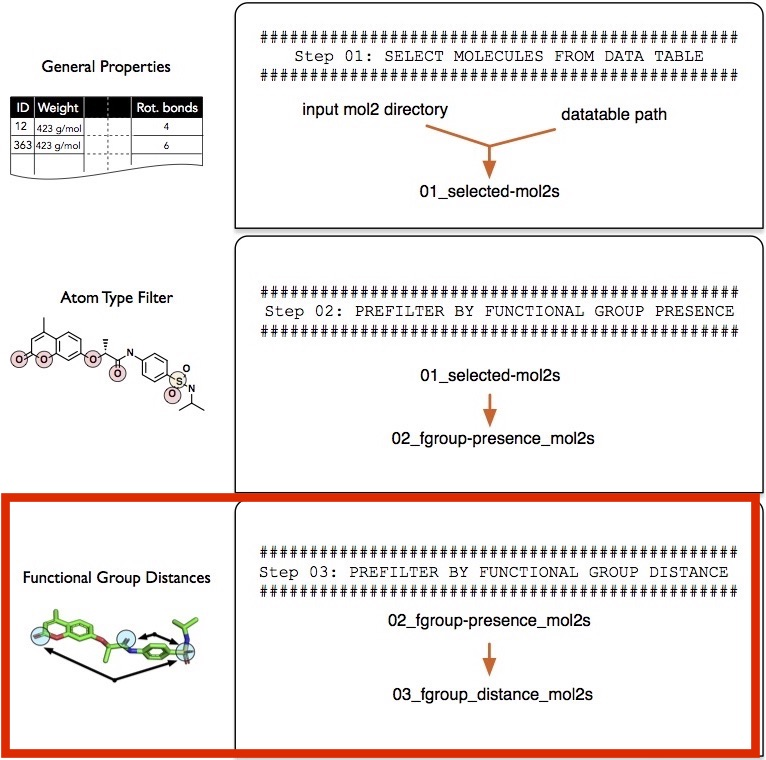

<div class="alert alert-block alert-info"> &#9888; Technically, we could have skipped the section "Filtering Step 2" and directly proceeded with the distance-based atom selection described in this section. However, note that distance calculations are computationally more expensive than merely checking for the presence of certain atoms and functional groups. Thus, but separating those two tasks, we can filter out molecules that don't contain a keto and a sp3 sulfur atoms first.</div>

The selection string syntax is analogous to the `--selection` parameter described in the "Filtering Step 2" --  please revisit this section if you need a refresher. However, it shall be noted that the distance selection only works for a pair of atoms. For example, the following string

"((atom_type == 'S.3') | (atom_type == 'S.o2')) --> (atom_type == 'O.2')"

checks the distance between an atom A, which is either an S.3 or an S.o2 atom, and an atom B, which is an O.2 atom. If you want to compute the distance between multiple atoms, for example, the distance of atom A to atoms B and C, you need to repeat the distance selection multiple times. For example, you would perform the distance selection between A and B first, and then, in a second iteration, you would perform the distance selection on the results of the first selection, to select molecules based on the distance between atom A and C.

Now, let us execute the first step of a filtering step in screenlamp and create an ID file of molecules that have an sp3 sulfur and an O.2 atom within a 13-20 angstrom distance. 


```python
! python tools/funcgroup_distance_to_id.py \
  --input tutorial-results/02_fgroup_presence_mol2s \
  --output tutorial-results/03_fgroup_distance_mol2s.txt \
  --selection "((atom_type == 'S.3') | (atom_type == 'S.o2')) --> (atom_type == 'O.2')" \
  --distance "13-20" \
  --processes 0
```

    Using selection: ["((pdmol.df.atom_type == 'S.3') | (pdmol.df.atom_type == 'S.o2'))", "(pdmol.df.atom_type == 'O.2')"]
    Processing partition_1.mol2 | 196 mol/sec
    Processing partition_2.mol2 | 235 mol/sec
    Processing partition_3.mol2 | 244 mol/sec
    Processing partition_4.mol2 | 228 mol/sec
    Processing partition_5.mol2 | 226 mol/sec
    Processing partition_6.mol2 | 228 mol/sec
    Processing partition_7.mol2 | 220 mol/sec
    Finished


Following the already familiar procedure, we can now select the MOL2 structures using the generated ID file:


```python
! python tools/id_to_mol2.py \
  --input tutorial-results/02_fgroup_presence_mol2s \
  --output tutorial-results/03_fgroup_distance_mol2s \
  --id_file tutorial-results/03_fgroup_distance_mol2s.txt \
  --includelist True
```

    Processing partition_1.mol2 | scanned 2140 molecules | 18214 mol/sec
    Processing partition_2.mol2 | scanned 2118 molecules | 16030 mol/sec
    Processing partition_3.mol2 | scanned 2064 molecules | 12371 mol/sec
    Processing partition_4.mol2 | scanned 2107 molecules | 14275 mol/sec
    Processing partition_5.mol2 | scanned 2068 molecules | 14494 mol/sec
    Processing partition_6.mol2 | scanned 2189 molecules | 12596 mol/sec
    Processing partition_7.mol2 | scanned 2186 molecules | 14133 mol/sec
    Finished


```python
! python tools/count_mol2.py \
  --input tutorial-results/03_fgroup_distance_mol2s
```

    partition_1.mol2 : 16
    partition_2.mol2 : 16
    partition_3.mol2 : 13
    partition_4.mol2 : 15
    partition_5.mol2 : 12
    partition_6.mol2 : 20
    partition_7.mol2 : 15
    Total : 107


After applying this distance-based filtering step, we can see that only 107 molecules out of the 14,872 from "[Filtering Step 2 -- Presence and Absence of Functional Groups](#Filtering Step 2 -- Presence and Absence of Functional Groups)" remain.

## Step 4 -- Generating Conformers

In this section, we are going to generate low-energy conformers of the molecules we have selected so far. In the next section, we are going to use these favorable-energy conformations and overlay them with a query molecule.

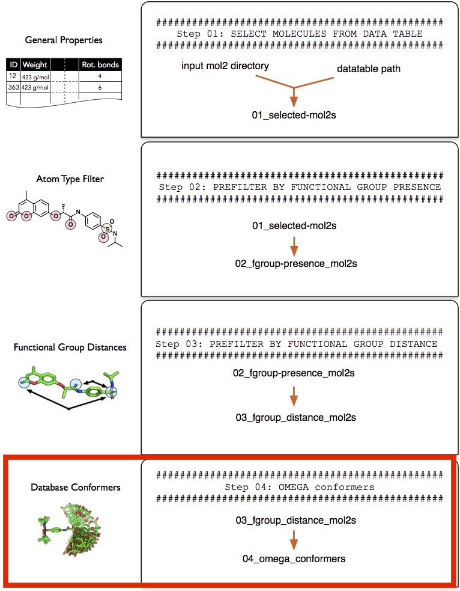

Generating low-energy conformers of either database or reference molecule is highly recommended to account for the flexibility of molecules (for instance, rotatable bonds) when overlaying molecules (in the next step, "Step 5 -- Overlaying Reference and Database molecules"). However, note that working with low-energy conformers increases the computational cost involved in computing the optimal overlays. For example, assuming that we have 10,000 database molecules and one reference molecule, generating 200 low-energy conformers of each of those database molecules would result in a database of 10,000x200 = 2,000,000 molecules. Consequently, we will have to sample 2,000,000x1 overlays (200 overlays per database molecule) instead of 10,000 overlays to obtain the best-overlaying pairs. To take it a step further, we could also consider multiple conformers of the reference molecule. For example, if we create 200 conformers of the one reference molecule as well, we will have to overlay 2000,000x200 = 40,000,000 pairs. To summarize, the three different options as input for overlaying the reference molecule with the database molecule are given below, in increasing order of computational cost, which is proportional to the thoroughness of the sampling procedure:

1) Overlay a single conformer for both database and the reference molecule
2) Overlay a single reference molecule conformer with multiple database molecule conformers
3) Overlay multiple reference molecule conformers with multiple database molecule conformers

In this tutorial, we will use option 3), where we create up to 200 conformers of each database molecule using OpenEye Omega and overlay them with an existing multi-conformer reference molecule that is already provided with the tutorial files (`3kpzs_query.mol2`, which contains 35 favorable-energy conformers of the reference molecule 3kPZS).


Again, please note the creating multiple conformers of a molecule is optional. The program we are going to use is OpenEye Omega, but you may use alternative tools as well, as long as they can output those conformer structures in MOL2 file format. 

<div class="alert alert-block alert-info"> &#9888; Please also note that the conformers of a given molecule (database or reference molecule) files should have the same molecule ID in the MOL2 files to parse the output of "[Step 5 -- Overlaying Reference and Database molecules](#Step-5----Overlaying-Reference-and-Database-molecules)" without additional workarounds. For example, if you have a multi-conformer MOL2 file such as 3kpzs_query.mol2, make sure that the molecule IDs in the MOL2 file are all "3kPZS" and don't have any suffixes or prefixes such as "3kPZS_1, 3KPZS_2, ...". The reason why we want to avoid prefixes and suffixes in those conformer names is that the overlay tool OpenEye ROCS identifies conformers by their structure, not their names, and such molecule IDs would only result in annoying name mangling, which makes the results harder to parse downstream in the analysis pipeline. </div>

<div class="alert alert-block alert-info"> &#9888;  Optionally, ["Step 3 -- Filtering by Distance between Functional Groups"](Step-3----Filtering-by-Distance-between-Functional-Groups) can also be repeated on the output of this step, the low-energy conformers, to sort out conformers where functional groups are in a spatial arrangement that may not be consistent with prior knowledge -- for example, experimental insights that a molecule interacts via certain groups in a particular way with its binding partner.</div>

While you can use OpenEye Omega directly from the command line as described in the documentation at https://www.eyesopen.com/omega, screenlamp provides a wrapper tool that generates multiconformer files of all mol2 files in a given directory using its default settings, which can be used as shown below (note that you need to provide an `--executable` path pointing to the Omega program on your machine:


```python
! python tools/run_omega.py \
  --input tutorial-results/03_fgroup_distance_mol2s \
  --output tutorial-results/04_omega_confomers/ \
  --executable "/Applications/OMEGA 2.5.1.4.app/Contents/MacOS/omega2-2.5.1.4" \
  --processes 0
```

    Processing tutorial-results/03_fgroup_distance_mol2s/partition_1.mol2
    Slave started on host Sebastians-MacBook-Pro
    Slave started on host Sebastians-MacBook-Pro
    Slave started on host Sebastians-MacBook-Pro
    
              :jGf:             .d8888b. 88d8b.d8b. .d8888b. .d8888b. .d8888b.
            :jGDDDDf:           88'  `88 88'`88'`88 88ooood8 88'  `88 88'  `88
          ,fDDDGjLDDDf,         88.  .88 88  88  88 88.  ... 88.  .88 88.  .88
        ,fDDLt:   :iLDDL;       `88888P' dP  dP  dP `88888P' `8888P88 `88888P8
      ;fDLt:         :tfDG;                                       .88
    ,jft:   ,ijfffji,   :iff                                  d8888P
         .jGDDDDDDDDDGt.      
        ;GDDGt:''':tDDDG,          Copyright (c) 2004-2013
       .DDDG:       :GDDG.         OpenEye Scientific Software, Inc.
       ;DDDj         tDDDi    
       ,DDDf         fDDD,         Version: 2.5.1.4
        LDDDt.     .fDDDj          Built:   20130515
        .tDDDDfjtjfDDDGt           OEChem version: 1.9.1
          :ifGDDDDDGfi.            Platform: osx-10.8-clang++4-x64
              .:::.                
      ......................       
      DDDDDDDDDDDDDDDDDDDDDD       
      DDDDDDDDDDDDDDDDDDDDDD       
    
    Supported run modes:
      Single processor
      MPI Multiprocessor
    
      Licensed for the exclusive use of The Laboratory of Leslie Kuhn.
      Licensed for use only in Michigan State University.
      License expires on October 20, 2017.
    
    
    To cite OMEGA please use the following:
      OMEGA 2.5.1.4: OpenEye Scientific Software, Santa Fe, NM.
      http://www.eyesopen.com.
    
      Hawkins, P.C.D.; Skillman, A.G.; Warren, G.L.; Ellingson, B.A.; Stahl, M.T.
      Conformer Generation with OMEGA: Algorithm and Validation Using High
      Quality Structures from the Protein Databank and the Cambridge 
      Structural Database. J. Chem. Inf. Model. 2010, 50, 572-584.
    
    Running as MPI Master
    ...ce_mol2s/partition_1.mol2|****************************************|100.00%
    Processing tutorial-results/03_fgroup_distance_mol2s/partition_2.mol2
    Slave started on host Sebastians-MacBook-Pro
    Slave started on host Sebastians-MacBook-Pro
    
              :jGf:             .d8888b. 88d8b.d8b. .d8888b. .d8888b. .d8888b.
            :jGDDDDf:           88'  `88 88'`88'`88 88ooood8 88'  `88 88'  `88
          ,fDDDGjLDDDf,         88.  .88 88  88  88 88.  ... 88.  .88 88.  .88
        ,fDDLt:   :iLDDL;       `88888P' dP  dP  dP `88888P' `8888P88 `88888P8
      ;fDLt:         :tfDG;                                       .88
    ,jft:   ,ijfffji,   :iff                                  d8888P
         .jGDDDDDDDDDGt.      
        ;GDDGt:''':tDDDG,          Copyright (c) 2004-2013
       .DDDG:       :GDDG.         OpenEye Scientific Software, Inc.
       ;DDDj         tDDDi    
       ,DDDf         fDDD,         Version: 2.5.1.4
        LDDDt.     .fDDDj          Built:   20130515
        .tDDDDfjtjfDDDGt           OEChem version: 1.9.1
          :ifGDDDDDGfi.            Platform: osx-10.8-clang++4-x64
              .:::.                
      ......................       
      DDDDDDDDDDDDDDDDDDDDDD       
      DDDDDDDDDDDDDDDDDDDDDD       
    
    Supported run modes:
      Single processor
      MPI Multiprocessor
    
      Licensed for the exclusive use of The Laboratory of Leslie Kuhn.
      Licensed for use only in Michigan State University.
      License expires on October 20, 2017.
    
    
    To cite OMEGA please use the following:
      OMEGA 2.5.1.4: OpenEye Scientific Software, Santa Fe, NM.
      http://www.eyesopen.com.
    
      Hawkins, P.C.D.; Skillman, A.G.; Warren, G.L.; Ellingson, B.A.; Stahl, M.T.
      Conformer Generation with OMEGA: Algorithm and Validation Using High
      Quality Structures from the Protein Databank and the Cambridge 
      Structural Database. J. Chem. Inf. Model. 2010, 50, 572-584.
    
    Running as MPI Master
    Slave started on host Sebastians-MacBook-Pro
    ...ce_mol2s/partition_2.mol2|****************************************|100.00%
    Processing tutorial-results/03_fgroup_distance_mol2s/partition_3.mol2
    Slave started on host Sebastians-MacBook-Pro
    Slave started on host Sebastians-MacBook-Pro
    Slave started on host Sebastians-MacBook-Pro
    
              :jGf:             .d8888b. 88d8b.d8b. .d8888b. .d8888b. .d8888b.
            :jGDDDDf:           88'  `88 88'`88'`88 88ooood8 88'  `88 88'  `88
          ,fDDDGjLDDDf,         88.  .88 88  88  88 88.  ... 88.  .88 88.  .88
        ,fDDLt:   :iLDDL;       `88888P' dP  dP  dP `88888P' `8888P88 `88888P8
      ;fDLt:         :tfDG;                                       .88
    ,jft:   ,ijfffji,   :iff                                  d8888P
         .jGDDDDDDDDDGt.      
        ;GDDGt:''':tDDDG,          Copyright (c) 2004-2013
       .DDDG:       :GDDG.         OpenEye Scientific Software, Inc.
       ;DDDj         tDDDi    
       ,DDDf         fDDD,         Version: 2.5.1.4
        LDDDt.     .fDDDj          Built:   20130515
        .tDDDDfjtjfDDDGt           OEChem version: 1.9.1
          :ifGDDDDDGfi.            Platform: osx-10.8-clang++4-x64
              .:::.                
      ......................       
      DDDDDDDDDDDDDDDDDDDDDD       
      DDDDDDDDDDDDDDDDDDDDDD       
    
    Supported run modes:
      Single processor
      MPI Multiprocessor
    
      Licensed for the exclusive use of The Laboratory of Leslie Kuhn.
      Licensed for use only in Michigan State University.
      License expires on October 20, 2017.
    
    
    To cite OMEGA please use the following:
      OMEGA 2.5.1.4: OpenEye Scientific Software, Santa Fe, NM.
      http://www.eyesopen.com.
    
      Hawkins, P.C.D.; Skillman, A.G.; Warren, G.L.; Ellingson, B.A.; Stahl, M.T.
      Conformer Generation with OMEGA: Algorithm and Validation Using High
      Quality Structures from the Protein Databank and the Cambridge 
      Structural Database. J. Chem. Inf. Model. 2010, 50, 572-584.
    
    Running as MPI Master
    ...ce_mol2s/partition_3.mol2|****************************************|100.00%
    Processing tutorial-results/03_fgroup_distance_mol2s/partition_4.mol2
    Slave started on host Sebastians-MacBook-Pro
    Slave started on host Sebastians-MacBook-Pro
    Slave started on host Sebastians-MacBook-Pro
    
              :jGf:             .d8888b. 88d8b.d8b. .d8888b. .d8888b. .d8888b.
            :jGDDDDf:           88'  `88 88'`88'`88 88ooood8 88'  `88 88'  `88
          ,fDDDGjLDDDf,         88.  .88 88  88  88 88.  ... 88.  .88 88.  .88
        ,fDDLt:   :iLDDL;       `88888P' dP  dP  dP `88888P' `8888P88 `88888P8
      ;fDLt:         :tfDG;                                       .88
    ,jft:   ,ijfffji,   :iff                                  d8888P
         .jGDDDDDDDDDGt.      
        ;GDDGt:''':tDDDG,          Copyright (c) 2004-2013
       .DDDG:       :GDDG.         OpenEye Scientific Software, Inc.
       ;DDDj         tDDDi    
       ,DDDf         fDDD,         Version: 2.5.1.4
        LDDDt.     .fDDDj          Built:   20130515
        .tDDDDfjtjfDDDGt           OEChem version: 1.9.1
          :ifGDDDDDGfi.            Platform: osx-10.8-clang++4-x64
              .:::.                
      ......................       
      DDDDDDDDDDDDDDDDDDDDDD       
      DDDDDDDDDDDDDDDDDDDDDD       
    
    Supported run modes:
      Single processor
      MPI Multiprocessor
    
      Licensed for the exclusive use of The Laboratory of Leslie Kuhn.
      Licensed for use only in Michigan State University.
      License expires on October 20, 2017.
    
    
    To cite OMEGA please use the following:
      OMEGA 2.5.1.4: OpenEye Scientific Software, Santa Fe, NM.
      http://www.eyesopen.com.
    
      Hawkins, P.C.D.; Skillman, A.G.; Warren, G.L.; Ellingson, B.A.; Stahl, M.T.
      Conformer Generation with OMEGA: Algorithm and Validation Using High
      Quality Structures from the Protein Databank and the Cambridge 
      Structural Database. J. Chem. Inf. Model. 2010, 50, 572-584.
    
    Running as MPI Master
    ...ce_mol2s/partition_4.mol2|****************************************|100.00%
    Processing tutorial-results/03_fgroup_distance_mol2s/partition_5.mol2
    Slave started on host Sebastians-MacBook-Pro
    Slave started on host Sebastians-MacBook-Pro
    Slave started on host Sebastians-MacBook-Pro
    
              :jGf:             .d8888b. 88d8b.d8b. .d8888b. .d8888b. .d8888b.
            :jGDDDDf:           88'  `88 88'`88'`88 88ooood8 88'  `88 88'  `88
          ,fDDDGjLDDDf,         88.  .88 88  88  88 88.  ... 88.  .88 88.  .88
        ,fDDLt:   :iLDDL;       `88888P' dP  dP  dP `88888P' `8888P88 `88888P8
      ;fDLt:         :tfDG;                                       .88
    ,jft:   ,ijfffji,   :iff                                  d8888P
         .jGDDDDDDDDDGt.      
        ;GDDGt:''':tDDDG,          Copyright (c) 2004-2013
       .DDDG:       :GDDG.         OpenEye Scientific Software, Inc.
       ;DDDj         tDDDi    
       ,DDDf         fDDD,         Version: 2.5.1.4
        LDDDt.     .fDDDj          Built:   20130515
        .tDDDDfjtjfDDDGt           OEChem version: 1.9.1
          :ifGDDDDDGfi.            Platform: osx-10.8-clang++4-x64
              .:::.                
      ......................       
      DDDDDDDDDDDDDDDDDDDDDD       
      DDDDDDDDDDDDDDDDDDDDDD       
    
    Supported run modes:
      Single processor
      MPI Multiprocessor
    
      Licensed for the exclusive use of The Laboratory of Leslie Kuhn.
      Licensed for use only in Michigan State University.
      License expires on October 20, 2017.
    
    
    To cite OMEGA please use the following:
      OMEGA 2.5.1.4: OpenEye Scientific Software, Santa Fe, NM.
      http://www.eyesopen.com.
    
      Hawkins, P.C.D.; Skillman, A.G.; Warren, G.L.; Ellingson, B.A.; Stahl, M.T.
      Conformer Generation with OMEGA: Algorithm and Validation Using High
      Quality Structures from the Protein Databank and the Cambridge 
      Structural Database. J. Chem. Inf. Model. 2010, 50, 572-584.
    
    Running as MPI Master
    ...ce_mol2s/partition_5.mol2|****************************************|100.00%
    Processing tutorial-results/03_fgroup_distance_mol2s/partition_6.mol2
    Slave started on host Sebastians-MacBook-Pro
    Slave started on host Sebastians-MacBook-Pro
    Slave started on host Sebastians-MacBook-Pro
    
              :jGf:             .d8888b. 88d8b.d8b. .d8888b. .d8888b. .d8888b.
            :jGDDDDf:           88'  `88 88'`88'`88 88ooood8 88'  `88 88'  `88
          ,fDDDGjLDDDf,         88.  .88 88  88  88 88.  ... 88.  .88 88.  .88
        ,fDDLt:   :iLDDL;       `88888P' dP  dP  dP `88888P' `8888P88 `88888P8
      ;fDLt:         :tfDG;                                       .88
    ,jft:   ,ijfffji,   :iff                                  d8888P
         .jGDDDDDDDDDGt.      
        ;GDDGt:''':tDDDG,          Copyright (c) 2004-2013
       .DDDG:       :GDDG.         OpenEye Scientific Software, Inc.
       ;DDDj         tDDDi    
       ,DDDf         fDDD,         Version: 2.5.1.4
        LDDDt.     .fDDDj          Built:   20130515
        .tDDDDfjtjfDDDGt           OEChem version: 1.9.1
          :ifGDDDDDGfi.            Platform: osx-10.8-clang++4-x64
              .:::.                
      ......................       
      DDDDDDDDDDDDDDDDDDDDDD       
      DDDDDDDDDDDDDDDDDDDDDD       
    
    Supported run modes:
      Single processor
      MPI Multiprocessor
    
      Licensed for the exclusive use of The Laboratory of Leslie Kuhn.
      Licensed for use only in Michigan State University.
      License expires on October 20, 2017.
    
    
    To cite OMEGA please use the following:
      OMEGA 2.5.1.4: OpenEye Scientific Software, Santa Fe, NM.
      http://www.eyesopen.com.
    
      Hawkins, P.C.D.; Skillman, A.G.; Warren, G.L.; Ellingson, B.A.; Stahl, M.T.
      Conformer Generation with OMEGA: Algorithm and Validation Using High
      Quality Structures from the Protein Databank and the Cambridge 
      Structural Database. J. Chem. Inf. Model. 2010, 50, 572-584.
    
    Running as MPI Master
    ...ce_mol2s/partition_6.mol2|****************************************|100.00%
    Processing tutorial-results/03_fgroup_distance_mol2s/partition_7.mol2
    Slave started on host Sebastians-MacBook-Pro
    Slave started on host Sebastians-MacBook-Pro
    Slave started on host Sebastians-MacBook-Pro
    
              :jGf:             .d8888b. 88d8b.d8b. .d8888b. .d8888b. .d8888b.
            :jGDDDDf:           88'  `88 88'`88'`88 88ooood8 88'  `88 88'  `88
          ,fDDDGjLDDDf,         88.  .88 88  88  88 88.  ... 88.  .88 88.  .88
        ,fDDLt:   :iLDDL;       `88888P' dP  dP  dP `88888P' `8888P88 `88888P8
      ;fDLt:         :tfDG;                                       .88
    ,jft:   ,ijfffji,   :iff                                  d8888P
         .jGDDDDDDDDDGt.      
        ;GDDGt:''':tDDDG,          Copyright (c) 2004-2013
       .DDDG:       :GDDG.         OpenEye Scientific Software, Inc.
       ;DDDj         tDDDi    
       ,DDDf         fDDD,         Version: 2.5.1.4
        LDDDt.     .fDDDj          Built:   20130515
        .tDDDDfjtjfDDDGt           OEChem version: 1.9.1
          :ifGDDDDDGfi.            Platform: osx-10.8-clang++4-x64
              .:::.                
      ......................       
      DDDDDDDDDDDDDDDDDDDDDD       
      DDDDDDDDDDDDDDDDDDDDDD       
    
    Supported run modes:
      Single processor
      MPI Multiprocessor
    
      Licensed for the exclusive use of The Laboratory of Leslie Kuhn.
      Licensed for use only in Michigan State University.
      License expires on October 20, 2017.
    
    
    To cite OMEGA please use the following:
      OMEGA 2.5.1.4: OpenEye Scientific Software, Santa Fe, NM.
      http://www.eyesopen.com.
    
      Hawkins, P.C.D.; Skillman, A.G.; Warren, G.L.; Ellingson, B.A.; Stahl, M.T.
      Conformer Generation with OMEGA: Algorithm and Validation Using High
      Quality Structures from the Protein Databank and the Cambridge 
      Structural Database. J. Chem. Inf. Model. 2010, 50, 572-584.
    
    Running as MPI Master
    ...ce_mol2s/partition_7.mol2|****************************************|100.00%


By default, Omega samples up to 50,000 conformer structures and keeps up to 200 conformers with favorable energy per molecule. Additional arguments can be provided using `--settings` flag of `run_omega.py`. For example, to increase the maximum number of conformers to keep from 200 to 500, you can provide the following argument: `"--settings -maxconfs 500 \"`.

Now that we created the conformers of the database molecules, let us count the number of structures that we would consider for the pair-wise overlays in the next step:


```python
! python tools/count_mol2.py \
  --input tutorial-results/04_omega_confomers/
```

    partition_1.mol2 : 2940
    partition_2.mol2 : 2768
    partition_3.mol2 : 2263
    partition_4.mol2 : 2550
    partition_5.mol2 : 2394
    partition_6.mol2 : 3433
    partition_7.mol2 : 2693
    Total : 19041


As we can see, we now have 19,041 structures to consider, which means Omega created ~200 low-energy (favorable) conformers of the 107 single-conformer input structures in `03_fgroup_distance_mol2s`.

## Step 5 -- Overlaying Reference and Database Molecules

In this section we are going to overlay the database conformers we generated in `tutorial-results/04_omega_confomers/` that we generated in the previous step ("[Step 4 -- Generating Conformers](Step-4----Generating-Conformers)") with 35 conformers of the reference molecule (called 3kPZS), which are provided in the tutorial dataset as `3kpzs_query.mol2`. 

<div class="alert alert-block alert-info"> &#9888; Note that if you are working with your own reference molecule, conformers can be generated similar to generating database molecules as described in section "[Step 4 -- Generating Conformers](Step-4----Generating-Conformers)".</div>


Screenlamp provides a wrapper tool `run_rocs.py` that wraps OpenEye ROCS for generating molecular overlays. For more information about ROCS, please see https://www.eyesopen.com/rocs. The `run_rocs.py` wrapper uses ROCS's default settings plus additional settings provided as arguments to the `--settings` parameter of `run_rocs.py`. For more information about the ROCS settings, please refer to the official documentation at https://www.eyesopen.com/rocs. The settings we are going to use will overlay each query conformer with each database conformer, and it will only keep the best overlay for each multi-conformer per. For instance, if we have 200 conformers of a database molecule A and 200 conformers of a reference molecule B, only the single best overlay out of the 200x200 overlays will be kept.


```python
! python tools/run_rocs.py \
  --input tutorial-results/04_omega_confomers/ \
  --output tutorial-results/05_rocs_overlays/ \
  --query tk-tutorial_data/3kpzs_query.mol2 \
  --executable "/Applications/ROCS 3.2.1.4.app/Contents/MacOS/rocs-3.2.1.4" \
  --settings "-rankby TanimotoCombo -maxhits 0 -besthits 0 -progress percent" \
  --processes 0
```

    Processing partition_1.mol2
              :jGf:               
            :jGDDDDf:             
          ,fDDDGjLDDDf,           'a8  ,a'8b   a''8b    a''8b  a8f'8
        ,fDDLt:   :iLDDL;          88 a/  88  d'   8b  d'  88  88'  
      ;fDLt:         :tfDG;        88P    8f d8    88 d8       '88aa
    ,jft:   ,ijfffji,   :iff       8P        88    8P 88      a  '888
         .jGDDDDDDDDDGt.           8i        88   d8  Y8   ,d 8    8P
        ;GDDGt:''':tDDDG,          a8/        `88aa'    '8aa'  'baa8'
       .DDDG:       :GDDG.    
       ;DDDj         tDDDi    
       ,DDDf         fDDD,         Copyright (C) 1997-2015
        LDDDt.     .fDDDj          OpenEye Scientific Software, Inc.
        .tDDDDfjtjfDDDGt      
          :ifGDDDDDGfi.            Version: 3.2.1.4
              .:::.                Built:   20150831
      ......................       OEChem version: 2.0.4
      DDDDDDDDDDDDDDDDDDDDDD       Platform: osx-10.10-clang++6-x64
      DDDDDDDDDDDDDDDDDDDDDD  
    
    Supported run modes:
      Single processor
      MPI Multiprocessor
    
      Licensed for the exclusive use of The Laboratory of Leslie Kuhn.
      Licensed for use only in Michigan State University.
      License expires on October 20, 2017.
    
    
    To cite ROCS please use the following:
      ROCS 3.2.1.4: OpenEye Scientific Software, Santa Fe, NM.
      http://www.eyesopen.com.
    
      Hawkins, P.C.D.; Skillman, A.G.; Nicholls, A. Comparison of Shape-Matching
      and Docking as Virtual Screening Tools. J. Med. Chem., 2007, 50, 74.
    
    Slave started on host Sebastians-MacBook-Pro
    Slave started on host Sebastians-MacBook-Pro
    Slave started on host Sebastians-MacBook-Pro
    Running as MPI Master
      database file: tutorial-results/04_omega_confomers/partition_1.mol2
    
    Query being read from:         	tk-tutorial_data/3kpzs_query.mol2
    File prefix is:                	tutorial-results/05_rocs_overlays/partition_1
    Output directory:              	/Users/sebastian/code/screenlamp/docs/sources/user_guide
    Log file will be written to: 	tutorial-results/05_rocs_overlays/partition_1.log
    Statistics will be written to:	tutorial-results/05_rocs_overlays/partition_1_1.rpt
    Hit structures will written to:	tutorial-results/05_rocs_overlays/partition_1_hits_1.mol2
    Status file will be written to:	tutorial-results/05_rocs_overlays/partition_1_1.status
    
    Query(#1): 3KPZS has 35 conformer(s)
    Database 1 of 1:              	tutorial-results/04_omega_confomers/partition_1.mol2
    ...onfomers/partition_1.mol2|****************************************|100.00%
    
    16 molecules in 41 seconds -> 0.4 molecules/sec
                                  2510 overlays/sec
    
    16 hits found
    =================================================
    
    Molecule read failures: 0
    #warnings             : 0
    #errors               : 0
    #queries processed    : 1
    Processing partition_2.mol2
    Slave started on host Sebastians-MacBook-Pro
    Slave started on host Sebastians-MacBook-Pro
              :jGf:               
            :jGDDDDf:             
          ,fDDDGjLDDDf,           'a8  ,a'8b   a''8b    a''8b  a8f'8
        ,fDDLt:   :iLDDL;          88 a/  88  d'   8b  d'  88  88'  
      ;fDLt:         :tfDG;        88P    8f d8    88 d8       '88aa
    ,jft:   ,ijfffji,   :iff       8P        88    8P 88      a  '888
         .jGDDDDDDDDDGt.           8i        88   d8  Y8   ,d 8    8P
        ;GDDGt:''':tDDDG,          a8/        `88aa'    '8aa'  'baa8'
       .DDDG:       :GDDG.    
       ;DDDj         tDDDi    
       ,DDDf         fDDD,         Copyright (C) 1997-2015
        LDDDt.     .fDDDj          OpenEye Scientific Software, Inc.
        .tDDDDfjtjfDDDGt      
          :ifGDDDDDGfi.            Version: 3.2.1.4
              .:::.                Built:   20150831
      ......................       OEChem version: 2.0.4
      DDDDDDDDDDDDDDDDDDDDDD       Platform: osx-10.10-clang++6-x64
      DDDDDDDDDDDDDDDDDDDDDD  
    
    Supported run modes:
      Single processor
      MPI Multiprocessor
    
      Licensed for the exclusive use of The Laboratory of Leslie Kuhn.
      Licensed for use only in Michigan State University.
      License expires on October 20, 2017.
    
    
    To cite ROCS please use the following:
      ROCS 3.2.1.4: OpenEye Scientific Software, Santa Fe, NM.
      http://www.eyesopen.com.
    
      Hawkins, P.C.D.; Skillman, A.G.; Nicholls, A. Comparison of Shape-Matching
      and Docking as Virtual Screening Tools. J. Med. Chem., 2007, 50, 74.
    
    Slave started on host Sebastians-MacBook-Pro
    Running as MPI Master
      database file: tutorial-results/04_omega_confomers/partition_2.mol2
    
    Query being read from:         	tk-tutorial_data/3kpzs_query.mol2
    File prefix is:                	tutorial-results/05_rocs_overlays/partition_2
    Output directory:              	/Users/sebastian/code/screenlamp/docs/sources/user_guide
    Log file will be written to: 	tutorial-results/05_rocs_overlays/partition_2.log
    Statistics will be written to:	tutorial-results/05_rocs_overlays/partition_2_1.rpt
    Hit structures will written to:	tutorial-results/05_rocs_overlays/partition_2_hits_1.mol2
    Status file will be written to:	tutorial-results/05_rocs_overlays/partition_2_1.status
    
    Query(#1): 3KPZS has 35 conformer(s)
    Database 1 of 1:              	tutorial-results/04_omega_confomers/partition_2.mol2
    ...onfomers/partition_2.mol2|****************************************|100.00%
    
    16 molecules in 47 seconds -> 0.3 molecules/sec
                                  2061 overlays/sec
    
    16 hits found
    =================================================
    
    Molecule read failures: 0
    #warnings             : 0
    #errors               : 0
    #queries processed    : 1
    Processing partition_3.mol2
    Slave started on host Sebastians-MacBook-Pro
    Slave started on host Sebastians-MacBook-Pro
    Slave started on host Sebastians-MacBook-Pro
              :jGf:               
            :jGDDDDf:             
          ,fDDDGjLDDDf,           'a8  ,a'8b   a''8b    a''8b  a8f'8
        ,fDDLt:   :iLDDL;          88 a/  88  d'   8b  d'  88  88'  
      ;fDLt:         :tfDG;        88P    8f d8    88 d8       '88aa
    ,jft:   ,ijfffji,   :iff       8P        88    8P 88      a  '888
         .jGDDDDDDDDDGt.           8i        88   d8  Y8   ,d 8    8P
        ;GDDGt:''':tDDDG,          a8/        `88aa'    '8aa'  'baa8'
       .DDDG:       :GDDG.    
       ;DDDj         tDDDi    
       ,DDDf         fDDD,         Copyright (C) 1997-2015
        LDDDt.     .fDDDj          OpenEye Scientific Software, Inc.
        .tDDDDfjtjfDDDGt      
          :ifGDDDDDGfi.            Version: 3.2.1.4
              .:::.                Built:   20150831
      ......................       OEChem version: 2.0.4
      DDDDDDDDDDDDDDDDDDDDDD       Platform: osx-10.10-clang++6-x64
      DDDDDDDDDDDDDDDDDDDDDD  
    
    Supported run modes:
      Single processor
      MPI Multiprocessor
    
      Licensed for the exclusive use of The Laboratory of Leslie Kuhn.
      Licensed for use only in Michigan State University.
      License expires on October 20, 2017.
    
    
    To cite ROCS please use the following:
      ROCS 3.2.1.4: OpenEye Scientific Software, Santa Fe, NM.
      http://www.eyesopen.com.
    
      Hawkins, P.C.D.; Skillman, A.G.; Nicholls, A. Comparison of Shape-Matching
      and Docking as Virtual Screening Tools. J. Med. Chem., 2007, 50, 74.
    
    Running as MPI Master
      database file: tutorial-results/04_omega_confomers/partition_3.mol2
    
    Query being read from:         	tk-tutorial_data/3kpzs_query.mol2
    File prefix is:                	tutorial-results/05_rocs_overlays/partition_3
    Output directory:              	/Users/sebastian/code/screenlamp/docs/sources/user_guide
    Log file will be written to: 	tutorial-results/05_rocs_overlays/partition_3.log
    Statistics will be written to:	tutorial-results/05_rocs_overlays/partition_3_1.rpt
    Hit structures will written to:	tutorial-results/05_rocs_overlays/partition_3_hits_1.mol2
    Status file will be written to:	tutorial-results/05_rocs_overlays/partition_3_1.status
    
    Query(#1): 3KPZS has 35 conformer(s)
    Database 1 of 1:              	tutorial-results/04_omega_confomers/partition_3.mol2
    ...onfomers/partition_3.mol2|****************************************|100.00%
    
    13 molecules in 30 seconds -> 0.4 molecules/sec
                                  2640 overlays/sec
    
    13 hits found
    =================================================
    
    Molecule read failures: 0
    #warnings             : 0
    #errors               : 0
    #queries processed    : 1
    Processing partition_4.mol2
    Slave started on host Sebastians-MacBook-Pro
    Slave started on host Sebastians-MacBook-Pro
              :jGf:               
            :jGDDDDf:             
          ,fDDDGjLDDDf,           'a8  ,a'8b   a''8b    a''8b  a8f'8
        ,fDDLt:   :iLDDL;          88 a/  88  d'   8b  d'  88  88'  
      ;fDLt:         :tfDG;        88P    8f d8    88 d8       '88aa
    ,jft:   ,ijfffji,   :iff       8P        88    8P 88      a  '888
         .jGDDDDDDDDDGt.           8i        88   d8  Y8   ,d 8    8P
        ;GDDGt:''':tDDDG,          a8/        `88aa'    '8aa'  'baa8'
       .DDDG:       :GDDG.    
       ;DDDj         tDDDi    
       ,DDDf         fDDD,         Copyright (C) 1997-2015
        LDDDt.     .fDDDj          OpenEye Scientific Software, Inc.
        .tDDDDfjtjfDDDGt      
          :ifGDDDDDGfi.            Version: 3.2.1.4
              .:::.                Built:   20150831
      ......................       OEChem version: 2.0.4
      DDDDDDDDDDDDDDDDDDDDDD       Platform: osx-10.10-clang++6-x64
      DDDDDDDDDDDDDDDDDDDDDD  
    
    Supported run modes:
      Single processor
      MPI Multiprocessor
    
      Licensed for the exclusive use of The Laboratory of Leslie Kuhn.
      Licensed for use only in Michigan State University.
      License expires on October 20, 2017.
    
    
    To cite ROCS please use the following:
      ROCS 3.2.1.4: OpenEye Scientific Software, Santa Fe, NM.
      http://www.eyesopen.com.
    
      Hawkins, P.C.D.; Skillman, A.G.; Nicholls, A. Comparison of Shape-Matching
      and Docking as Virtual Screening Tools. J. Med. Chem., 2007, 50, 74.
    
    Slave started on host Sebastians-MacBook-Pro
    Running as MPI Master
      database file: tutorial-results/04_omega_confomers/partition_4.mol2
    
    Query being read from:         	tk-tutorial_data/3kpzs_query.mol2
    File prefix is:                	tutorial-results/05_rocs_overlays/partition_4
    Output directory:              	/Users/sebastian/code/screenlamp/docs/sources/user_guide
    Log file will be written to: 	tutorial-results/05_rocs_overlays/partition_4.log
    Statistics will be written to:	tutorial-results/05_rocs_overlays/partition_4_1.rpt
    Hit structures will written to:	tutorial-results/05_rocs_overlays/partition_4_hits_1.mol2
    Status file will be written to:	tutorial-results/05_rocs_overlays/partition_4_1.status
    
    Query(#1): 3KPZS has 35 conformer(s)
    Database 1 of 1:              	tutorial-results/04_omega_confomers/partition_4.mol2
    ...onfomers/partition_4.mol2|****************************************|100.00%
    
    15 molecules in 42 seconds -> 0.4 molecules/sec
                                  2125 overlays/sec
    
    15 hits found
    =================================================
    
    Molecule read failures: 0
    #warnings             : 0
    #errors               : 0
    #queries processed    : 1
    Processing partition_5.mol2
    Slave started on host Sebastians-MacBook-Pro
    Slave started on host Sebastians-MacBook-Pro
              :jGf:               
            :jGDDDDf:             
          ,fDDDGjLDDDf,           'a8  ,a'8b   a''8b    a''8b  a8f'8
        ,fDDLt:   :iLDDL;          88 a/  88  d'   8b  d'  88  88'  
      ;fDLt:         :tfDG;        88P    8f d8    88 d8       '88aa
    ,jft:   ,ijfffji,   :iff       8P        88    8P 88      a  '888
         .jGDDDDDDDDDGt.           8i        88   d8  Y8   ,d 8    8P
        ;GDDGt:''':tDDDG,          a8/        `88aa'    '8aa'  'baa8'
       .DDDG:       :GDDG.    
       ;DDDj         tDDDi    
       ,DDDf         fDDD,         Copyright (C) 1997-2015
        LDDDt.     .fDDDj          OpenEye Scientific Software, Inc.
        .tDDDDfjtjfDDDGt      
          :ifGDDDDDGfi.            Version: 3.2.1.4
              .:::.                Built:   20150831
      ......................       OEChem version: 2.0.4
      DDDDDDDDDDDDDDDDDDDDDD       Platform: osx-10.10-clang++6-x64
      DDDDDDDDDDDDDDDDDDDDDD  
    
    Supported run modes:
      Single processor
      MPI Multiprocessor
    
      Licensed for the exclusive use of The Laboratory of Leslie Kuhn.
      Licensed for use only in Michigan State University.
      License expires on October 20, 2017.
    
    
    To cite ROCS please use the following:
      ROCS 3.2.1.4: OpenEye Scientific Software, Santa Fe, NM.
      http://www.eyesopen.com.
    
      Hawkins, P.C.D.; Skillman, A.G.; Nicholls, A. Comparison of Shape-Matching
      and Docking as Virtual Screening Tools. J. Med. Chem., 2007, 50, 74.
    
    Slave started on host Sebastians-MacBook-Pro
    Running as MPI Master
      database file: tutorial-results/04_omega_confomers/partition_5.mol2
    
    Query being read from:         	tk-tutorial_data/3kpzs_query.mol2
    File prefix is:                	tutorial-results/05_rocs_overlays/partition_5
    Output directory:              	/Users/sebastian/code/screenlamp/docs/sources/user_guide
    Log file will be written to: 	tutorial-results/05_rocs_overlays/partition_5.log
    Statistics will be written to:	tutorial-results/05_rocs_overlays/partition_5_1.rpt
    Hit structures will written to:	tutorial-results/05_rocs_overlays/partition_5_hits_1.mol2
    Status file will be written to:	tutorial-results/05_rocs_overlays/partition_5_1.status
    
    Query(#1): 3KPZS has 35 conformer(s)
    Database 1 of 1:              	tutorial-results/04_omega_confomers/partition_5.mol2
    ...onfomers/partition_5.mol2|****************************************|100.00%
    
    12 molecules in 40 seconds -> 0.3 molecules/sec
                                  2095 overlays/sec
    
    12 hits found
    =================================================
    
    Molecule read failures: 0
    #warnings             : 0
    #errors               : 0
    #queries processed    : 1
    Processing partition_6.mol2
    Slave started on host Sebastians-MacBook-Pro
    Slave started on host Sebastians-MacBook-Pro
    Slave started on host Sebastians-MacBook-Pro
              :jGf:               
            :jGDDDDf:             
          ,fDDDGjLDDDf,           'a8  ,a'8b   a''8b    a''8b  a8f'8
        ,fDDLt:   :iLDDL;          88 a/  88  d'   8b  d'  88  88'  
      ;fDLt:         :tfDG;        88P    8f d8    88 d8       '88aa
    ,jft:   ,ijfffji,   :iff       8P        88    8P 88      a  '888
         .jGDDDDDDDDDGt.           8i        88   d8  Y8   ,d 8    8P
        ;GDDGt:''':tDDDG,          a8/        `88aa'    '8aa'  'baa8'
       .DDDG:       :GDDG.    
       ;DDDj         tDDDi    
       ,DDDf         fDDD,         Copyright (C) 1997-2015
        LDDDt.     .fDDDj          OpenEye Scientific Software, Inc.
        .tDDDDfjtjfDDDGt      
          :ifGDDDDDGfi.            Version: 3.2.1.4
              .:::.                Built:   20150831
      ......................       OEChem version: 2.0.4
      DDDDDDDDDDDDDDDDDDDDDD       Platform: osx-10.10-clang++6-x64
      DDDDDDDDDDDDDDDDDDDDDD  
    
    Supported run modes:
      Single processor
      MPI Multiprocessor
    
      Licensed for the exclusive use of The Laboratory of Leslie Kuhn.
      Licensed for use only in Michigan State University.
      License expires on October 20, 2017.
    
    
    To cite ROCS please use the following:
      ROCS 3.2.1.4: OpenEye Scientific Software, Santa Fe, NM.
      http://www.eyesopen.com.
    
      Hawkins, P.C.D.; Skillman, A.G.; Nicholls, A. Comparison of Shape-Matching
      and Docking as Virtual Screening Tools. J. Med. Chem., 2007, 50, 74.
    
    Running as MPI Master
      database file: tutorial-results/04_omega_confomers/partition_6.mol2
    
    Query being read from:         	tk-tutorial_data/3kpzs_query.mol2
    File prefix is:                	tutorial-results/05_rocs_overlays/partition_6
    Output directory:              	/Users/sebastian/code/screenlamp/docs/sources/user_guide
    Log file will be written to: 	tutorial-results/05_rocs_overlays/partition_6.log
    Statistics will be written to:	tutorial-results/05_rocs_overlays/partition_6_1.rpt
    Hit structures will written to:	tutorial-results/05_rocs_overlays/partition_6_hits_1.mol2
    Status file will be written to:	tutorial-results/05_rocs_overlays/partition_6_1.status
    
    Query(#1): 3KPZS has 35 conformer(s)
    Database 1 of 1:              	tutorial-results/04_omega_confomers/partition_6.mol2
    ...onfomers/partition_6.mol2|****************************************|100.00%
    
    20 molecules in 66 seconds -> 0.3 molecules/sec
                                  1821 overlays/sec
    
    20 hits found
    =================================================
    
    Molecule read failures: 0
    #warnings             : 0
    #errors               : 0
    #queries processed    : 1
    Processing partition_7.mol2
    Slave started on host Sebastians-MacBook-Pro
    Slave started on host Sebastians-MacBook-Pro
    Slave started on host Sebastians-MacBook-Pro
              :jGf:               
            :jGDDDDf:             
          ,fDDDGjLDDDf,           'a8  ,a'8b   a''8b    a''8b  a8f'8
        ,fDDLt:   :iLDDL;          88 a/  88  d'   8b  d'  88  88'  
      ;fDLt:         :tfDG;        88P    8f d8    88 d8       '88aa
    ,jft:   ,ijfffji,   :iff       8P        88    8P 88      a  '888
         .jGDDDDDDDDDGt.           8i        88   d8  Y8   ,d 8    8P
        ;GDDGt:''':tDDDG,          a8/        `88aa'    '8aa'  'baa8'
       .DDDG:       :GDDG.    
       ;DDDj         tDDDi    
       ,DDDf         fDDD,         Copyright (C) 1997-2015
        LDDDt.     .fDDDj          OpenEye Scientific Software, Inc.
        .tDDDDfjtjfDDDGt      
          :ifGDDDDDGfi.            Version: 3.2.1.4
              .:::.                Built:   20150831
      ......................       OEChem version: 2.0.4
      DDDDDDDDDDDDDDDDDDDDDD       Platform: osx-10.10-clang++6-x64
      DDDDDDDDDDDDDDDDDDDDDD  
    
    Supported run modes:
      Single processor
      MPI Multiprocessor
    
      Licensed for the exclusive use of The Laboratory of Leslie Kuhn.
      Licensed for use only in Michigan State University.
      License expires on October 20, 2017.
    
    
    To cite ROCS please use the following:
      ROCS 3.2.1.4: OpenEye Scientific Software, Santa Fe, NM.
      http://www.eyesopen.com.
    
      Hawkins, P.C.D.; Skillman, A.G.; Nicholls, A. Comparison of Shape-Matching
      and Docking as Virtual Screening Tools. J. Med. Chem., 2007, 50, 74.
    
    Running as MPI Master
      database file: tutorial-results/04_omega_confomers/partition_7.mol2
    
    Query being read from:         	tk-tutorial_data/3kpzs_query.mol2
    File prefix is:                	tutorial-results/05_rocs_overlays/partition_7
    Output directory:              	/Users/sebastian/code/screenlamp/docs/sources/user_guide
    Log file will be written to: 	tutorial-results/05_rocs_overlays/partition_7.log
    Statistics will be written to:	tutorial-results/05_rocs_overlays/partition_7_1.rpt
    Hit structures will written to:	tutorial-results/05_rocs_overlays/partition_7_hits_1.mol2
    Status file will be written to:	tutorial-results/05_rocs_overlays/partition_7_1.status
    
    Query(#1): 3KPZS has 35 conformer(s)
    Database 1 of 1:              	tutorial-results/04_omega_confomers/partition_7.mol2
    ...onfomers/partition_7.mol2|****************************************|100.00%
    
    15 molecules in 40 seconds -> 0.4 molecules/sec
                                  2356 overlays/sec
    
    15 hits found
    =================================================
    
    Molecule read failures: 0
    #warnings             : 0
    #errors               : 0
    #queries processed    : 1


Although we had 19,041 database conformers, our conformer database only consists 107 unique structures (see " Filtering Step 3 -- Distance between Functional Groups"), so we expect ROCS to yield 107 best-overlay pairs, which we can check via the familiar `count_mol2.py` tool. 


<div class="alert alert-block alert-info"> &#9888; Note that in your own analyses, the number of input structures to Omega and output overlays from ROCS is not always the same. Potential sources for this, which we observed, is either that Omega cannot parse certain input structures and/or ROCS sometimes includes duplicates in the results. </div>


```python
! python tools/count_mol2.py \
  --input tutorial-results/05_rocs_overlays/
```

    partition_1_hits_1.mol2 : 16
    partition_2_hits_1.mol2 : 16
    partition_3_hits_1.mol2 : 13
    partition_4_hits_1.mol2 : 15
    partition_5_hits_1.mol2 : 12
    partition_6_hits_1.mol2 : 20
    partition_7_hits_1.mol2 : 15
    Total : 107


## Step 6 -- Sorting Molecular Overlays

In this section, we are going to sort the pair-wise overlays be overlay score and select only those molecules that meet at certain similarity threshold before we continue with the functional group matching in "[Step 7 -- Matching Functional Groups](Step 7 -- Matching Functional Groups)".

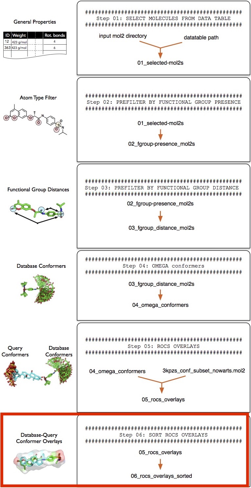

To make screenlamp's functional group matching procedure ("[Step 7 -- Matching Functional Groups](Step 7 -- Matching Functional Groups)") requires a general data input format to support a variety of overlay tools (other than ROCS). To bring the ROCS results into a more general format, we are going to use the `sort_rocs_mol2.py` utility tool provided in screenlamp.

Essentially, the `sort_rocs_mol2.py` tool will create a pair of `\*_query.mol2` and `\*_dbase.mol2` files that contain the same number of structures each based on the ROCS overlays. The `\*_dbase.mol2` file contains the database molecule and the `\*_query.mol2` contains the conformer of the reference molecule that corresponds to the best-matching database-reference pair. Besides, we use the `--sortby` parameter to sort the molecules by TanimotoCombo and ColorTanimoto score (in descending order, best matches come first) for visualization and remove bad overlays by setting minimum score thresholds based on the TanimotoCombo and ColorTanimoto similarity scores. The TanimotoCombo score measures the similarity between a pair of molecules based on the overall volumetric match (ShapeTanimoto) and the electrostatic similarity (ColorTanimoto). For more information about the different scoring metrics implemented in ROCS, please refer to the official ROCS documentation at https://www.eyesopen.com/rocs.


```python
! python tools/sort_rocs_mol2.py \
  --input tutorial-results/05_rocs_overlays/ \
  --query tk-tutorial_data/3kpzs_query.mol2 \
  --output tutorial-results/06_rocs_overlays_sorted \
  --sortby TanimotoCombo,ColorTanimoto \
  --selection "(TanimotoCombo >= 0.75) & (ColorTanimoto >= 0.1)"\
  --id_suffix True
```

    Processing partition_1_hits_1.mol2 | scanned 12 molecules | 2039 mol/sec
    Processing partition_2_hits_1.mol2 | scanned 14 molecules | 5392 mol/sec
    Processing partition_3_hits_1.mol2 | scanned 11 molecules | 3583 mol/sec
    Processing partition_4_hits_1.mol2 | scanned 13 molecules | 5349 mol/sec
    Processing partition_5_hits_1.mol2 | scanned 11 molecules | 4619 mol/sec
    Processing partition_6_hits_1.mol2 | scanned 19 molecules | 4531 mol/sec
    Processing partition_7_hits_1.mol2 | scanned 13 molecules | 5286 mol/sec


---

**Note about the id_suffix parameter**

Note that if `--id_suffix True`, a molecule ID suffix will be added to the query molecules in the order the ROCS query molecules appear in a multi-conformer query file. For instance, if all query molecules are labeled "3kPZS", then the same structures in the output file are labeled 3kPZS_1, 3kPZS_2, and so on. Note that those modified conformer will correspond to the conformer names in the ROCS report tables. However, they may appear in an unsorted order in the _query files, which are sorted by the overlay score of the database molecules. For example, if the database molecule is called ZINC123_112, first entry in the _query file that corresponds to *_dbase file may by labeled 3kPZS_11 if the 11th 3kPZS conformer is the best match according to ROCS.

---

After using the `sort_rocs_mol2.py` utility script, we have a new directory that contains pairs of `*_dbase.mol2` and `*_query.mol2` conformers from the ROCS overlays:


```python
! python tools/count_mol2.py \
  --input tutorial-results/06_rocs_overlays_sorted
```

    partition_1_hits_1_dbase.mol2 : 11
    partition_1_hits_1_query.mol2 : 11
    partition_2_hits_1_dbase.mol2 : 13
    partition_2_hits_1_query.mol2 : 13
    partition_3_hits_1_dbase.mol2 : 10
    partition_3_hits_1_query.mol2 : 10
    partition_4_hits_1_dbase.mol2 : 12
    partition_4_hits_1_query.mol2 : 12
    partition_5_hits_1_dbase.mol2 : 10
    partition_5_hits_1_query.mol2 : 10
    partition_6_hits_1_dbase.mol2 : 18
    partition_6_hits_1_query.mol2 : 18
    partition_7_hits_1_dbase.mol2 : 12
    partition_7_hits_1_query.mol2 : 12
    Total : 172


## Step 7 -- Matching Functional Groups

Now that we have generated the multi-mol2 file pairs of the pair-wise overlays ('\*_query.mol2', and '\*_dbase.mol2') in "[Step 6 -- Sorting Molecular Overlays](#Step-6----Sorting-Molecular-Overlays)," we can proceed with the tabulation of functional group matches.

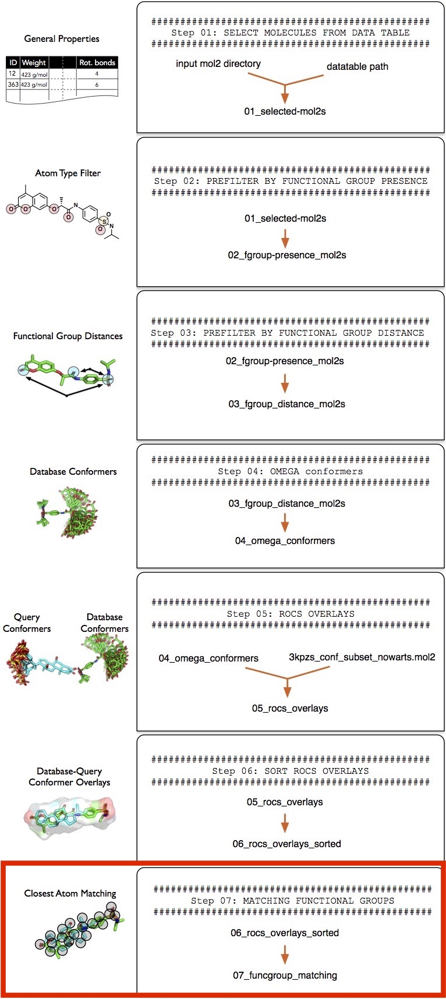

---


<div class="alert alert-block alert-info"> &#9888;
**Note about file suffixes.**

If you created molecular overlays using a different protocol than the one described in this tutorial please make sure that the file layout and the naming convention match the ones described in "Step 6 -- Sorting Molecular Overlays." In particular, it is important that the database molecule MOL2 files have the following file endings:

- _dbase.mol2 / _dbase.mol2.gz 

and the query molecules should end in 

- _query.mol2 / _query.mol2.gz 

Everything in front of the underscore character can be arbitrary but must also be consistent between "query" and "dbase" pairs, as shown in "Step 6 -- Sorting Molecular Overlays" and in the file listing below:

</div>

---


```python
! ls -1 tutorial-results/06_rocs_overlays_sorted/
```

    partition_1_hits_1_dbase.mol2
    partition_1_hits_1_query.mol2
    partition_2_hits_1_dbase.mol2
    partition_2_hits_1_query.mol2
    partition_3_hits_1_dbase.mol2
    partition_3_hits_1_query.mol2
    partition_4_hits_1_dbase.mol2
    partition_4_hits_1_query.mol2
    partition_5_hits_1_dbase.mol2
    partition_5_hits_1_query.mol2
    partition_6_hits_1_dbase.mol2
    partition_6_hits_1_query.mol2
    partition_7_hits_1_dbase.mol2
    partition_7_hits_1_query.mol2


For the functional group matching, we recommend using a threshold of 1.3 angstroms or less, since 1.5 angstrom constitutes the typical length of an atomic bond.


```python
! python tools/funcgroup_matching.py \
  --input tutorial-results/06_rocs_overlays_sorted \
  --output tutorial-results/07_funcgroup_matching \
  --max_distance 1.3 \
  --processes 0
```

    Processing partition_1_hits_1_dbase.mol2/partition_1_hits_1_query.mol2 | scanned 12 molecules | 21 mol/sec
    Processing partition_2_hits_1_dbase.mol2/partition_2_hits_1_query.mol2 | scanned 14 molecules | 21 mol/sec
    Processing partition_3_hits_1_dbase.mol2/partition_3_hits_1_query.mol2 | scanned 11 molecules | 20 mol/sec
    Processing partition_4_hits_1_dbase.mol2/partition_4_hits_1_query.mol2 | scanned 13 molecules | 23 mol/sec
    Processing partition_5_hits_1_dbase.mol2/partition_5_hits_1_query.mol2 | scanned 11 molecules | 20 mol/sec
    Processing partition_6_hits_1_dbase.mol2/partition_6_hits_1_query.mol2 | scanned 19 molecules | 22 mol/sec
    Processing partition_7_hits_1_dbase.mol2/partition_7_hits_1_query.mol2 | scanned 13 molecules | 23 mol/sec


The functional group matching results are collected in tabular form as regular text (.tsv) files with tab-separated columns. 


```python
! ls -1 tutorial-results/07_funcgroup_matching
```

    partition_1_hits_1_atomtype.tsv
    partition_1_hits_1_charge.tsv
    partition_2_hits_1_atomtype.tsv
    partition_2_hits_1_charge.tsv
    partition_3_hits_1_atomtype.tsv
    partition_3_hits_1_charge.tsv
    partition_4_hits_1_atomtype.tsv
    partition_4_hits_1_charge.tsv
    partition_5_hits_1_atomtype.tsv
    partition_5_hits_1_charge.tsv
    partition_6_hits_1_atomtype.tsv
    partition_6_hits_1_charge.tsv
    partition_7_hits_1_atomtype.tsv
    partition_7_hits_1_charge.tsv


As we can see from the file listing above, the functional group matching tool generated two tables for each partition. For instance, the functional group matching tables that correspond to partition_1 are

- partition_1_hits_1_atomtype.tsv
- partition_1_hits_1_charge.tsv

Below is an example of how a subsection of partition_1_hits_1_atomtype.tsv would look like if we would open it in a spreadsheet viewer (for example, LibreOffice Calc) for illustration:

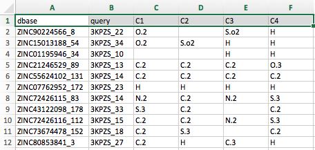

Note that the table screenshot above only shows the first six columns of the file. 

- The first column, dbase, refers to the database molecule's name
- The second column lists the corresponding reference molecule.
- The column headers after the second column correspond to the atom names of the reference (or query) molecule.

For instance, the first cell below the column header C1, which contains the entry "O.2" (shown in the annotated screenshot below):

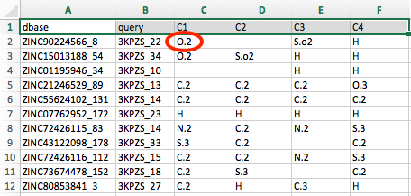

Lists the MOL2 atom type of the atom in the database molecule ZINC90224566_8 that overlays (or "matches") with the C1 atom in 3KPZS_22. Similarly, we can see that no atom in ZINC90224566_8 matches the C2 atom of 3KPZS_22, and an S.o2 atom matches the C3 atom of 3KPZS_22. 

To illustrate how to read this table more visually, we can open the corresponding MOL2 files for partition_1 in PyMOL:


Shown below is a screenshot of a PyMOL session showing the 3D structure overlay of ZINC90224566_8 and 3KPZS_22. The red arrows highlight the three columns that were discussed in the previous paragraph (ZINC90224566_8 is shown in green and 3KPZS_22 is shown in cyan):

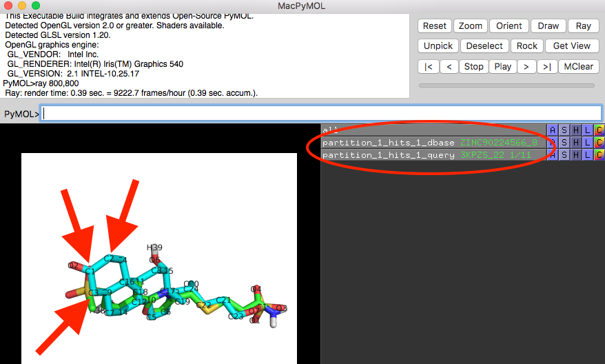

In addition to the atom type matching table, the functional group matching tool also outputs a second table for each partition analyzed. The format of this second table is identical to the atom type matching table except that its cells contain the partial charge information of the matching atom:

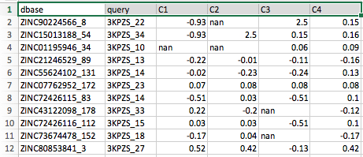

Note that the cells containing "nan" (which stands for "not a number") correspond to the empty cells in the atom type matching table we saw previously. Or in other words, "nan" cells indicate that no atom in the database molecule is matching a particular atom in the query molecule.


In the next step, "Step 8 -- Selecting Functional Group Matches," we will select database molecules of interest by specific functional group matching patterns or criteria.

## Step 8 -- Selecting Functional Group Matches

In this section, we are going to use the functional group matching tables we created in "[Step 7 -- Matching Functional Groups](#Step 7 -- Matching Functional Groups)". 

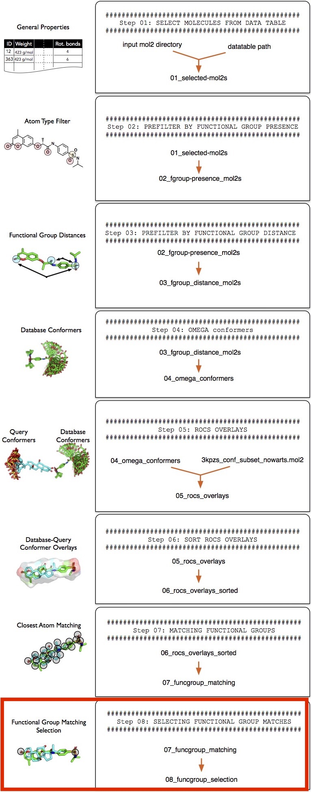

The `funcgroup_matching_selection.py` tool operates on the functional group matching tables that we created in the previous section, "Step 7 -- Matching Functional Groups." To select molecules of interest, we can define two selection strings:

1. `--atomtype_selection`, which operates on the MOL2 atom types stored in the \*_atomtype.tsv files  
2. `--charge_selection`, which operates on the partial charges stored in the \*_charge.tsv files

The selection strings work similar to the selection strings that were explained in Filtering "[Step 2 -- Presence and Absence of Functional Groups](#Step-2----Presence-and-Absence-of-Functional-Groups)." In the following example, we are going to select those molecules that

1. Have a sp3 sulfur match with the S1 atom in the reference molecule; the matched atom has to be positively charged
2. An sp2 oxygen match with the O2 atom in the reference molecule; the matched atom has to have a charge

For reference, these atoms or functional groups are highlighted in the 3kPZS reference molecule shown in the screenshot below:

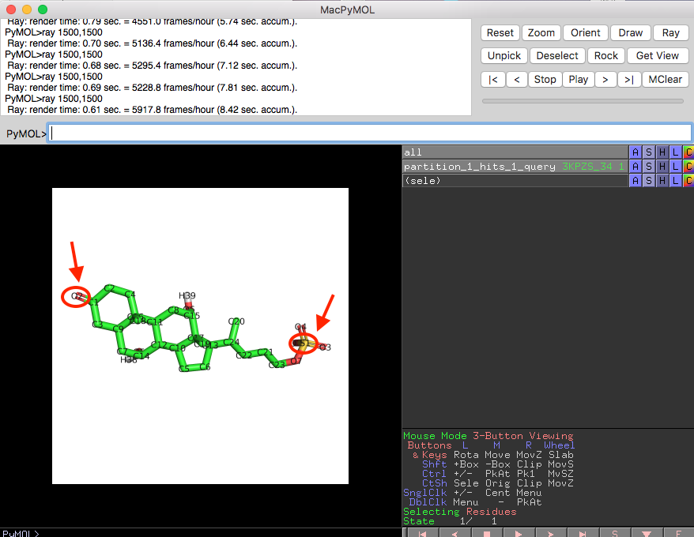

Using the selection criteria discussed above, that is, selecting molecules that match the 3-keto and the sulfate-group sulfur in 3kPZS, we use `tools/funcgroup_matching_selection.py` as shown below:


```python
! python tools/funcgroup_matching_selection.py \
  --input tutorial-results/07_funcgroup_matching \
  --output tutorial-results/08_funcgroup_selection \
  --atomtype_selection "((S1 == 'S.3') | (S1 == 'S.o2')) --> (O2 == 'O.2')" \
  --charge_selection "((S1 >= 1.0)) --> (O2 <= -0.5)"
```

    Processing partition_1_hits_1_atomtype.tsv/partition_1_hits_1_charge.tsv | scanned 11 molecules | 140 mol/sec
    Processing partition_2_hits_1_atomtype.tsv/partition_2_hits_1_charge.tsv | scanned 13 molecules | 407 mol/sec
    Processing partition_3_hits_1_atomtype.tsv/partition_3_hits_1_charge.tsv | scanned 10 molecules | 354 mol/sec
    Processing partition_4_hits_1_atomtype.tsv/partition_4_hits_1_charge.tsv | scanned 12 molecules | 379 mol/sec
    Processing partition_5_hits_1_atomtype.tsv/partition_5_hits_1_charge.tsv | scanned 10 molecules | 361 mol/sec
    Processing partition_6_hits_1_atomtype.tsv/partition_6_hits_1_charge.tsv | scanned 18 molecules | 577 mol/sec
    Processing partition_7_hits_1_atomtype.tsv/partition_7_hits_1_charge.tsv | scanned 12 molecules | 411 mol/sec


The output of this command will generate new \*_atomtype.tsv and \*_charge.tsv tables that only contain the matching molecules. However, it is often useful to collect the corresponding structures in MOL2 files, in sorted order, for inspection. To generate those MOL2 files, that contain the structures corresponding to the output tables, we can provide the overlays from "Step 6 -- Sorting Molecular Overlays" (06_rocs_overlays_sorted) as an argument to the `--input_mol2` parameters:


```python
! python tools/funcgroup_matching_selection.py \
  --input tutorial-results/07_funcgroup_matching \
  --input_mol2 tutorial-results/06_rocs_overlays_sorted \
  --output tutorial-results/08_funcgroup_selection \
  --atomtype_selection "((S1 == 'S.3') | (S1 == 'S.o2')) --> (O2 == 'O.2')" \
  --charge_selection "((S1 >= 1.0)) --> (O2 <= -0.5)"
```

    Processing partition_1_hits_1_atomtype.tsv/partition_1_hits_1_charge.tsv | scanned 11 molecules | 96 mol/sec
    Processing partition_2_hits_1_atomtype.tsv/partition_2_hits_1_charge.tsv | scanned 13 molecules | 333 mol/sec
    Processing partition_3_hits_1_atomtype.tsv/partition_3_hits_1_charge.tsv | scanned 10 molecules | 228 mol/sec
    Processing partition_4_hits_1_atomtype.tsv/partition_4_hits_1_charge.tsv | scanned 12 molecules | 234 mol/sec
    Processing partition_5_hits_1_atomtype.tsv/partition_5_hits_1_charge.tsv | scanned 10 molecules | 253 mol/sec
    Processing partition_6_hits_1_atomtype.tsv/partition_6_hits_1_charge.tsv | scanned 18 molecules | 457 mol/sec
    Processing partition_7_hits_1_atomtype.tsv/partition_7_hits_1_charge.tsv | scanned 12 molecules | 275 mol/sec


Now, let's have a look at one of the overlayed database molecule-reference molecule pairs from the functional group match selection:


For illustration, the numbers 0.6 and 0.9 correspond to the distance between the matched oxygen and sulfur atoms, respectively:

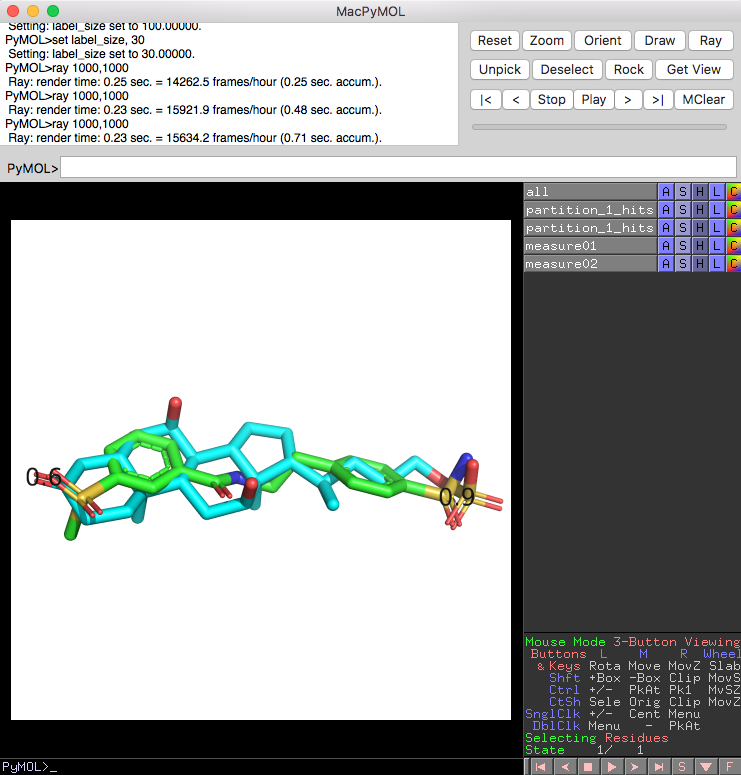

## Conclusion

While this tutorial provides a brief hands-on explanation of the different tools within screenlamp, and how to use them in concert, a real-world application would typically include millions of small molecules instead of the very small subset that we used in this tutorial. Also, the hypothesis-based selection (for instance, that matching the 3-keto and sulfate-sulfur in 3kPZS) is highly project-specific. To read more about this hypothesis-based selection approach, beyond this purely technical tutorial, please see our research publication ['Raschka, Sebastian, Anne M. Scott, Nan Liu, Santosh Gunturu, Mar Huertas, Weiming Li, and Leslie A. Kuhn (2017). "Enabling the hypothesis-driven prioritization of small molecules in large databases: Screenlamp and its application to GPCR inhibitor discovery"'](../cite)

## Where to Go Next: Using and Building Pipelines for Automation

Now that this tutorial introduced you to the individual tools within screenlamp, it is straightforward to build pipelines that execute the individual steps automatically. For instance, a pipeline that automates the 8 steps we worked through in this tutorial is provided as [tools/pipelines/pipeline-example-1.py](https://github.com/rasbt/screenlamp/blob/master/tools/pipelines/pipeline-example-1.py).

Essentially, this pipeline provides a more convenient way to interact with screenlamp in the way it was described in this tutorial:

1. Select molecules based on database properties.
2. Select molecules by the presence of particular functional groups.
3. Select molecules by the distance between certain functional groups.
4. Generate multiple favorable-energy conformers of each selected molecule.
5. Overlay the conformers of the reference and database molecules
6. Post process (sort) the overlay results and select molecules using similarity thresholds
7. Generate functional group matching tables
8. Select molecules based on functional group matching patterns

(You may use this pipeline as a template and modify it if you like to add additional steps or like to remove certain steps).

By default, this pipeline uses the selection parameters used in this tutorial via the corresponding configuration file ([tools/pipelines/pipeline-example-1-config.yaml](https://github.com/rasbt/screenlamp/blob/master/tools/pipelines/pipeline-example-1-config.yaml)). Since the reference molecule in your own project is likely a different one than the one we used in this tutorial, the configuration file offers a user-friendly way to tailor the analysis to your needs. 

For more information about this pipeline, please also see the more detailed ["Tutorial on Using a Pre-constructed Screenlamp Pipeline"](pipeline-tutorial-1).


```python

```
